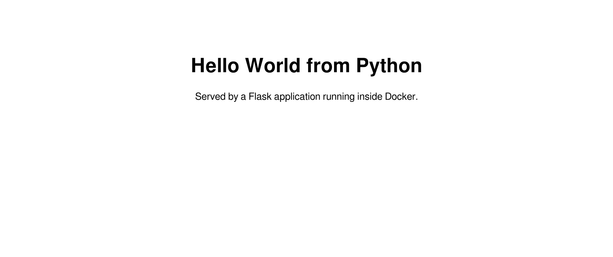
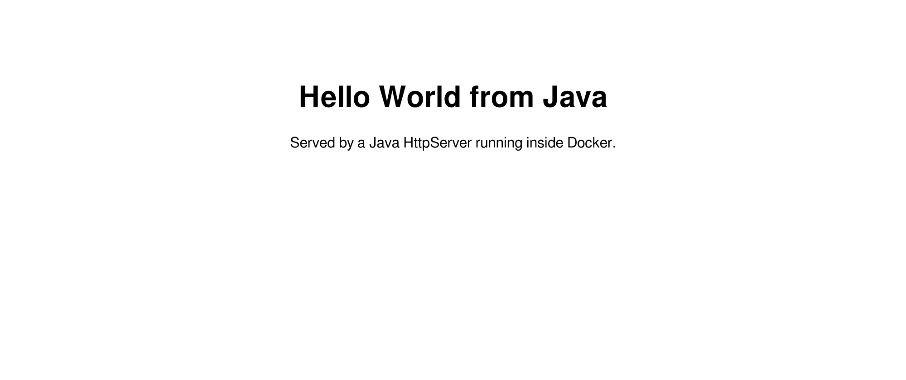
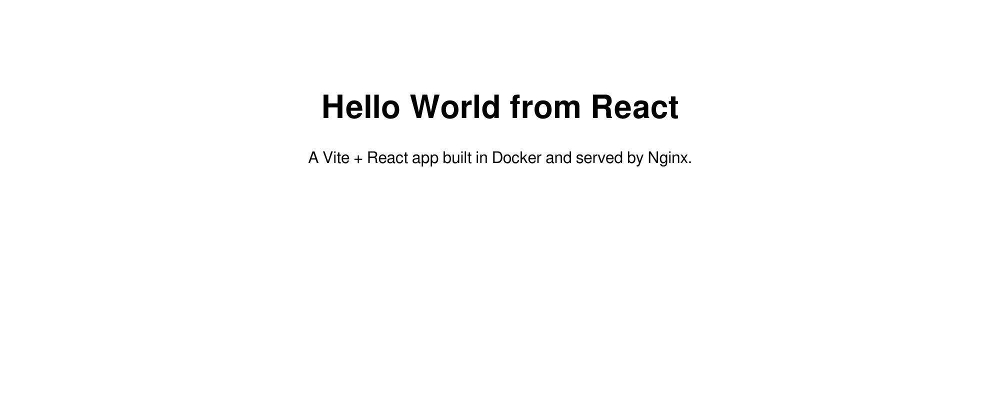

# Docker Fundamentals — Hands-On Assignment

This repository contains six containerized "Hello World" web applications built across different tech stacks and runtime environments. Each application lives in its own directory with a dedicated `Dockerfile`, configured to build, run, and serve traffic on a distinct host port.

---

## Student Details

| Field | Details |
|---|---|
| **Name** | Sambhav D Bohra |
| **Enrollment number** | 24bcs10090 |
| **Date** | 4 September 2026 |
| **Docker version** | 29.4.1 |

---

## Project Structure

Here is how the repository is organized:

```
Docker_Fundamentals/
├── nodejs-app/      Node.js HTTP server            → port 3000
├── python-app/      Flask                          → port 5000
├── java-app/        Java HttpServer                → port 8081
├── Apache-app/      Apache httpd                   → port 8082
├── React-app/       Vite + React, served by Nginx  → port 3001
├── nginx-app/       Nginx                          → port 8083
└── screenshots/     Browser screenshots of all six
```

---

## Overview & Verification

Summary of all six built images, container ports, and verification status:

| App | Image | Size | Host port | HTTP | Screenshot |
|---|---|---|---|---|---|
| Node.js | `nodejs-app:latest` | 232 MB | 3000 | 200 | [nodejs-app.png](screenshots/nodejs-app.png) |
| Python | `python-app:latest` | 208 MB | 5000 | 200 | [python-app.png](screenshots/python-app.png) |
| Java | `java-app:latest` | 454 MB | 8081 | 200 | [java-app.png](screenshots/java-app.png) |
| Apache | `apache-app:latest` | 175 MB | 8082 | 200 | [apache-app.png](screenshots/apache-app.png) |
| React | `react-app:latest` | 93.6 MB | 3001 | 200 | [react-app.png](screenshots/react-app.png) |
| Nginx | `nginx-app:latest` | 93.4 MB | 8083 | 200 | [nginx-app.png](screenshots/nginx-app.png) |

### `docker ps` — all six running simultaneously

```
$ docker ps --format 'table {{.Names}}\t{{.Image}}\t{{.Status}}\t{{.Ports}}'
NAMES             IMAGE                   STATUS             PORTS
nginx-hello       nginx-app:latest        Up 5 seconds       0.0.0.0:8083->80/tcp, [::]:8083->80/tcp
react-hello       react-app:latest        Up 7 seconds       0.0.0.0:3001->80/tcp, [::]:3001->80/tcp
apache-hello      apache-app:latest       Up 8 seconds       0.0.0.0:8082->80/tcp, [::]:8082->80/tcp
java-hello        java-app:latest         Up 9 seconds       0.0.0.0:8081->8080/tcp, [::]:8081->8080/tcp
python-hello      python-app:latest       Up 9 seconds       0.0.0.0:5000->5000/tcp, [::]:5000->5000/tcp
nodejs-hello      nodejs-app:latest       Up 10 seconds      0.0.0.0:3000->3000/tcp, [::]:3000->3000/tcp
```

### HTTP Verification Output

```
--- $ curl -s http://localhost:3000  (nodejs) ---
<h1>Hello World from Node.js</h1>
HTTP status: 200

--- $ curl -s http://localhost:5000  (python) ---
<h1>Hello World from Python</h1>
HTTP status: 200

--- $ curl -s http://localhost:8081  (java) ---
<h1>Hello World from Java</h1>
HTTP status: 200

--- $ curl -s http://localhost:8082  (apache) ---
<h1>Hello World from Apache</h1>
HTTP status: 200

--- $ curl -s http://localhost:3001  (react) ---
HTTP status: 200

--- $ curl -s http://localhost:8083  (nginx) ---
<h1>Hello World from Nginx</h1>
HTTP status: 200
```

### Screenshots

Browser previews of each container running locally:

| Node.js | Python |
|---|---|
|  |  |

| Java | Apache |
|---|---|
|  |  |

| React | Nginx |
|---|---|
|  |  |

---

## 1. `nodejs-app` — Node.js

A lightweight HTTP server built using Node's native `http` module. Since it doesn't use third-party packages, there is no need to run `npm install`, which keeps the build step quick and simple.

**Dockerfile**

```dockerfile
FROM node:22-alpine
WORKDIR /app
COPY package.json ./
COPY server.js ./
EXPOSE 3000
CMD ["node", "server.js"]
```

**Build and Run**

```bash
docker build -t nodejs-app ./nodejs-app
docker run -d --name nodejs-hello -p 3000:3000 nodejs-app:latest
```

```
$ docker build -t nodejs-app ./nodejs-app
#9 naming to docker.io/library/nodejs-app:latest done
#9 DONE 1.2s
```

Once running, visit <http://localhost:3000> to see **Hello World from Node.js**.

---

## 2. `python-app` — Python / Flask

A simple Flask web application running on Python 3.12.

**Dockerfile**

```dockerfile
FROM python:3.12-slim
WORKDIR /app
COPY requirements.txt ./
RUN pip install --no-cache-dir -r requirements.txt
COPY app.py ./
EXPOSE 5000
CMD ["python", "app.py"]
```

**Key Highlights:**
- **Layer Caching:** By copying and installing `requirements.txt` before copying `app.py`, Docker caches the installed packages. Whenever you edit the Python code, Docker reuses the cached dependencies instead of reinstalling them on every rebuild.
- **Image Optimization:** The `--no-cache-dir` flag prevents `pip` from storing downloaded wheel files inside the image layer.

**Build and Run**

```bash
docker build -t python-app ./python-app
docker run -d --name python-hello -p 5000:5000 python-app:latest
```

Once running, visit <http://localhost:5000> to see **Hello World from Python**.

---

## 3. `java-app` — Java

Because Java is a compiled language, we use a **multi-stage build**: a full JDK image compiles the source code, and a minimal JRE image runs the compiled `.class` file.

**Dockerfile**

```dockerfile
# Stage 1 - compile the Java source with a full JDK
FROM eclipse-temurin:21-jdk AS build
WORKDIR /src
COPY HelloWorld.java ./
RUN javac HelloWorld.java

# Stage 2 - ship only the compiled class on a smaller JRE
FROM eclipse-temurin:21-jre
WORKDIR /app
COPY --from=build /src/HelloWorld.class ./
EXPOSE 8080
CMD ["java", "HelloWorld"]
```

**Key Highlights:**
- The heavy JDK compiler and build tools stay in the build stage. Only the compiled `HelloWorld.class` binary is copied into the final runtime container using `COPY --from=build`.
- The application uses the built-in `com.sun.net.httpserver.HttpServer`, eliminating the need for Maven or Gradle build files for a simple endpoint.
- **Port Mapping:** The application listens on port `8080` inside the container and is mapped to port `8081` on the host to avoid port collisions.

**Build and Run**

```bash
docker build -t java-app ./java-app
docker run -d --name java-hello -p 8081:8080 java-app:latest
```

Once running, visit <http://localhost:8081> to see **Hello World from Java**.

---

## 4. `Apache-app` — Apache HTTP Server

A static web server setup using the Apache HTTP Server (`httpd`).

**Dockerfile**

```dockerfile
FROM httpd:2.4
COPY index.html /usr/local/apache2/htdocs/index.html
EXPOSE 80
```

**Key Highlights:**
- The official `httpd` image is pre-configured to run Apache automatically. All we need to do is copy `index.html` into Apache's default document root (`/usr/local/apache2/htdocs/`).

**Build and Run**

```bash
docker build -t apache-app ./Apache-app
docker run -d --name apache-hello -p 8082:80 apache-app:latest
```

Once running, visit <http://localhost:8082> to see **Hello World from Apache**.

---

## 5. `React-app` — React (Vite), built in Docker

A production-ready setup for a single-page React app (created with Vite), built inside Docker and served through an Nginx web server.

**Dockerfile**

```dockerfile
# Stage 1 - install dependencies and produce the static production build
FROM node:22-alpine AS build
WORKDIR /app
COPY package.json ./
RUN npm install
COPY vite.config.js index.html ./
COPY src ./src
RUN npm run build

# Stage 2 - serve the built static files with Nginx
FROM nginx:alpine
COPY --from=build /app/dist /usr/share/nginx/html
COPY nginx.conf /etc/nginx/conf.d/default.conf
EXPOSE 80
CMD ["nginx", "-g", "daemon off;"]
```

**Vite Build Output During Docker Build:**

```
#13 0.431 > react-hello-world@1.0.0 build
#13 0.431 > vite build
#13 0.648 vite v5.4.21 building for production...
#13 0.690 transforming...
#13 1.226 ✓ 30 modules transformed.
#13 1.296 rendering chunks...
#13 1.303 computing gzip size...
#13 1.309 dist/index.html                  0.33 kB │ gzip:  0.24 kB
#13 1.309 dist/assets/index-BORtQLi0.js  142.85 kB │ gzip: 45.91 kB
#13 1.309 ✓ built in 639ms
```

**Why multi-stage is effective here:**
- The final image size is just **93.6 MB** (smaller than the basic uncompiled Node.js image at 232 MB). Node.js, npm, and `node_modules` are all discarded after the build step. The production image only carries Nginx and the static bundle (~143 KB).
- The custom `nginx.conf` sets up `try_files $uri $uri/ /index.html;` to ensure client-side routing works smoothly without 404 errors on browser refreshes.

**Build and Run**

```bash
docker build -t react-app ./React-app
docker run -d --name react-hello -p 3001:80 react-app:latest
```

**Testing the React App:**

When checking with `curl`, you'll see the base HTML shell since React renders inside the browser:

```
$ curl -s http://localhost:3001/
<!doctype html>
<html lang="en">
  <head>
    <script type="module" crossorigin src="/assets/index-BORtQLi0.js"></script>
    <title>React Hello World</title>
  </head>
  <body>
    <div id="root"></div>
  </body>
</html>
```

The application text is bundled within the compiled JavaScript asset and rendered upon loading:

```
$ curl -s http://localhost:3001/assets/index-BORtQLi0.js | grep -o 'Hello World from React'
Hello World from React
```

Once running, visit <http://localhost:3001> to see **Hello World from React**.

---

## 6. `nginx-app` — Nginx

A minimal static web server using Nginx Alpine.

**Dockerfile**

```dockerfile
FROM nginx:alpine
COPY index.html /usr/share/nginx/html/index.html
EXPOSE 80
```

**Key Highlights:**
- We copy `index.html` directly into Nginx's default root directory (`/usr/share/nginx/html/`).
- Using `nginx:alpine` keeps the image lightweight (~93 MB vs ~190 MB for Debian-based `nginx:latest`).

**Build and Run**

```bash
docker build -t nginx-app ./nginx-app
docker run -d --name nginx-hello -p 8083:80 nginx-app:latest
```

Once running, visit <http://localhost:8083> to see **Hello World from Nginx**.

---

## Quick Commands / Cheat Sheet

To build, run, test, and clean up all six containers at once:

```bash
# Build all six images
docker build -t nodejs-app ./nodejs-app
docker build -t python-app ./python-app
docker build -t java-app   ./java-app
docker build -t apache-app ./Apache-app
docker build -t react-app  ./React-app
docker build -t nginx-app  ./nginx-app

# Run all six containers
docker run -d --name nodejs-hello -p 3000:3000 nodejs-app:latest
docker run -d --name python-hello -p 5000:5000 python-app:latest
docker run -d --name java-hello   -p 8081:8080 java-app:latest
docker run -d --name apache-hello -p 8082:80   apache-app:latest
docker run -d --name react-hello  -p 3001:80   react-app:latest
docker run -d --name nginx-hello  -p 8083:80   nginx-app:latest

# Verify containers and endpoints
docker ps
curl http://localhost:3000

# Stop and remove all containers
docker rm -f nodejs-hello python-hello java-hello apache-hello react-hello nginx-hello
```

---

## Key Docker Concepts Demonstrated

1. **Common Dockerfile Patterns:**
   - **Static Web Servers (Apache, Nginx):** Copy static assets into the server's web root. The base image handles the process startup.
   - **Interpreted Runtimes (Node.js, Python):** Copy application files, install dependencies, and define the runtime command using `CMD`.
   - **Compiled & Bundled Apps (Java, React):** Use **multi-stage builds** to build or compile assets in an intermediate container, then copy only the production artifacts into a lightweight runtime image.

2. **Layer Caching Optimization:**
   - Copying dependency manifests (`package.json`, `requirements.txt`) before application code ensures Docker caches installed dependencies. Modifying code won't trigger an unnecessary reinstall.

3. **Base Images & Image Sizing:**
   - Alpine-based images (`node:22-alpine`, `nginx:alpine`) drastically reduce image sizes compared to standard Debian/Ubuntu distributions.
   - Multi-stage builds keep production images lean (for example, React at ~93 MB because Node and `node_modules` are excluded from the final image).
   - For Java, a standard JRE image is around ~454 MB; using a tailored `jlink` runtime or an Alpine JRE variant can trim it down further.

4. **Port Forwarding vs `EXPOSE`:**
   - The `EXPOSE` instruction serves as documentation to describe which port the containerized process listens on.
   - Traffic routing only occurs when explicitly publishing ports at runtime with `-p <host-port>:<container-port>` (such as mapping container port `8080` to host port `8081` for the Java app).
