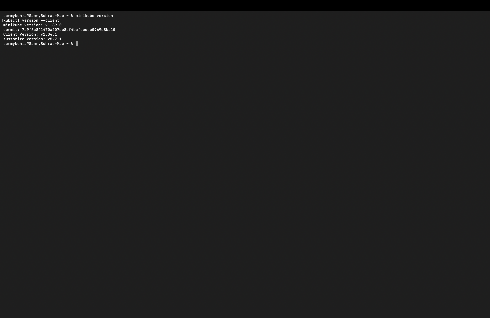
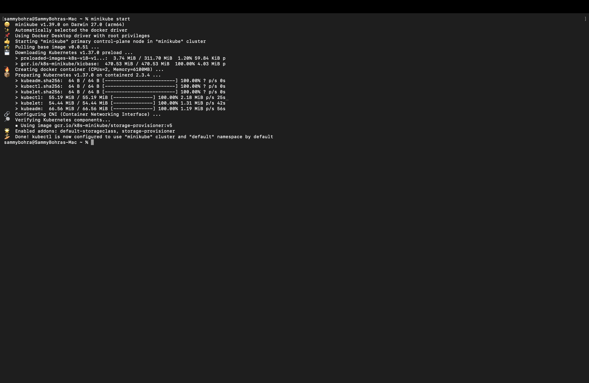
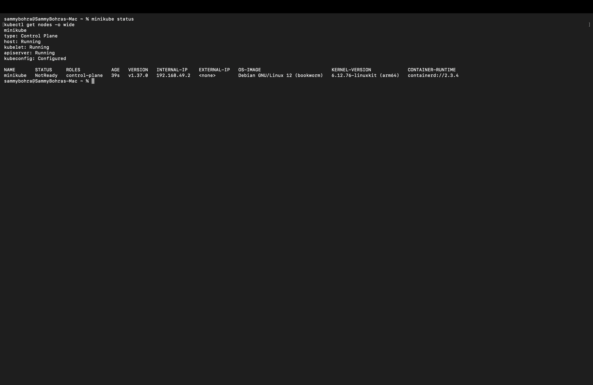
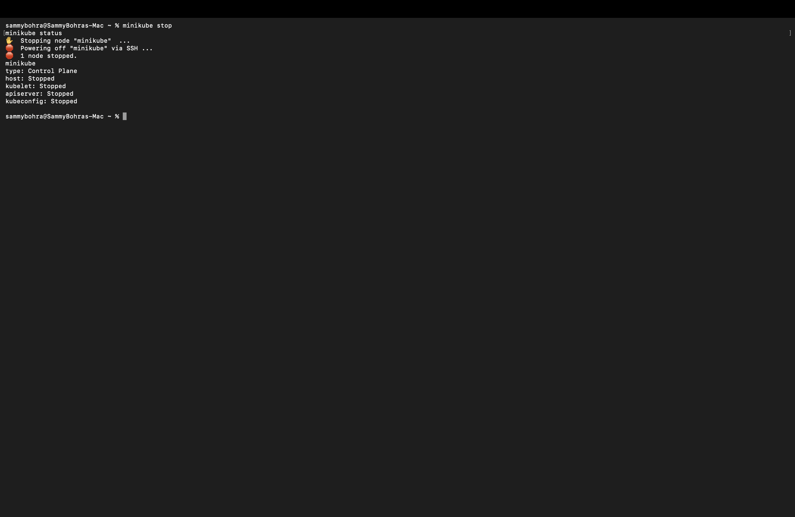
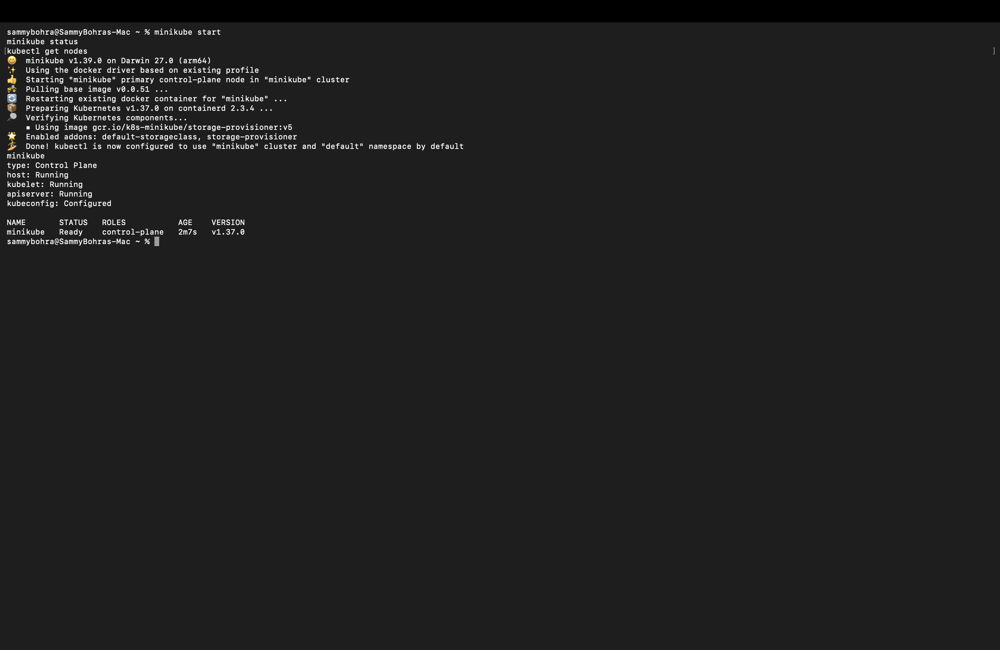

# Session 9 — Kubernetes Fundamentals & Cluster Architecture

**Author:** Sambhav D Bohra
**Enrollment number:** 24BCS10090
**Course:** SST DevOps & Cloud [SWE]
**Session:** 09 — Kubernetes Fundamentals

---

## Objective

Install and verify a local Kubernetes environment, exercise the full Minikube **cluster lifecycle**
(start → status → stop), and document the **Control Plane** and **Worker Node** components from the
official Kubernetes architecture documentation.

Every command below was actually executed on this machine and the outputs are copied verbatim from
the terminal session that the screenshots were taken from.

## Environment

| Component | Version / Value |
|---|---|
| OS | macOS 27.0 (Build 26A428), Apple Silicon (arm64) |
| Shell | zsh |
| Docker Desktop | 29.5.3 |
| Minikube | v1.39.0 |
| Driver | `docker` |
| kubectl (client) | v1.34.1 |
| Kubernetes (server) | v1.37.0 |
| Container runtime | containerd 2.3.4 |

---

## Task 1: Minikube & CLI Installation Verification

**Description:** Verify that Minikube and the Kubernetes CLI (`kubectl`) are installed and callable.

**Commands:**

```bash
minikube version
kubectl version --client
```

**Output:**

```
% minikube version
minikube version: v1.39.0
commit: 7a9f6a841470a207de8cf4bafcccee0969d8ba10

% kubectl version --client
Client Version: v1.34.1
Kustomize Version: v5.7.1
```

**Screenshot:**



**Interpretation:** Both binaries resolve on `PATH` and report versions, so the toolchain is
installed correctly. `kubectl version --client` deliberately queries only the local binary, so it
succeeds even before any cluster exists.

---

## Task 2: Starting the Minikube Kubernetes Cluster

**Description:** Bring up the local single-node Kubernetes cluster on the Docker driver.

**Command:**

```bash
minikube start
```

**Output (first-ever start on this machine):**

```
% minikube start
😄  minikube v1.39.0 on Darwin 27.0 (arm64)
✨  Automatically selected the docker driver
🔥  Using Docker Desktop driver with root privileges
👍  Starting "minikube" primary control-plane node in "minikube" cluster
🚜  Pulling base image v0.0.51 ...
💾  Downloading Kubernetes v1.37.0 preload ...
    > preloaded-images-k8s-v18-v1...: 311.70 MiB
    > gcr.io/k8s-minikube/kicbase: 470.53 MiB
🔥  Creating docker container (CPUs=2, Memory=6100MB) ...
📦  Preparing Kubernetes v1.37.0 on containerd 2.3.4 ...
🔗  Configuring CNI (Container Networking Interface) ...
🔎  Verifying Kubernetes components...
    ▪ Using image gcr.io/k8s-minikube/storage-provisioner:v5
🌟  Enabled addons: default-storageclass, storage-provisioner
🏄  Done! kubectl is now configured to use "minikube" cluster and "default" namespace by default
```

**Screenshot:**



**Interpretation:**

- `Automatically selected the docker driver` and `Creating docker container` confirm this was a
  genuine **first-time creation** of the `minikube` profile on this Mac, not a restart of an
  existing one.
- Minikube downloaded the Kubernetes v1.37.0 preload image bundle and the base `kicbase` image
  before creating the node container — expected on a clean install.
- `kubectl` client (v1.34.1) and server (v1.37.0) are within the supported skew window, so no
  compatibility warning was printed here.

---

## Task 3: Verifying Cluster Status & Node Health

**Description:** Confirm the control plane, kubelet and API server are running, and check the
node's readiness.

**Commands:**

```bash
minikube status
kubectl get nodes -o wide
```

**Output:**

```
% minikube status
minikube
type: Control Plane
host: Running
kubelet: Running
apiserver: Running
kubeconfig: Configured

% kubectl get nodes -o wide
NAME       STATUS     ROLES           AGE   VERSION   INTERNAL-IP    EXTERNAL-IP   OS-IMAGE                         KERNEL-VERSION         CONTAINER-RUNTIME
minikube   NotReady   control-plane   39s   v1.37.0   192.168.49.2   <none>        Debian GNU/Linux 12 (bookworm)   6.12.76-linuxkit (arm64)   containerd://2.3.4
```

**Screenshot:**



**Interpretation:**

- `minikube status` reports on the *infrastructure* — host container, kubelet and API server all
  `Running`, and `kubeconfig: Configured` means `kubectl` is already pointed at this cluster.
- `kubectl get nodes` reports on the *cluster* level, which lags slightly behind the infrastructure.
  This snapshot was taken only **39 seconds** after `minikube start` finished, so the node still
  shows `STATUS NotReady` — the kubelet was up but the CNI/network plugin hadn't finished reporting
  ready conditions yet. This is expected and self-resolves within a few seconds (see Task 5, where
  the node reports `Ready` after a later restart).
- `ROLES control-plane` on the only node confirms this is a **single-node** cluster where the
  control plane and the data plane share the same machine.
- The node runs `containerd`, not Docker, as its container runtime — the Docker shim was removed
  from Kubernetes in v1.24.

---

## Task 4: Stopping the Minikube Cluster

**Description:** Gracefully power down the cluster to release CPU and memory.

**Commands:**

```bash
minikube stop
minikube status
```

**Output:**

```
% minikube stop
✋  Stopping node "minikube"  ...
🛑  Powering off "minikube" via SSH ...
🛑  1 node stopped.

% minikube status
minikube
type: Control Plane
host: Stopped
kubelet: Stopped
apiserver: Stopped
kubeconfig: Stopped
```

**Screenshot:**



**Interpretation:**

- `Powering off "minikube" via SSH` shows this is a clean, in-guest shutdown rather than a hard
  container kill.
- Every line of `minikube status` flips to `Stopped`, including `kubeconfig`, so `kubectl` commands
  would fail to connect until the cluster is started again.
- **Stop is not delete.** `minikube stop` preserves the profile, its disk and all Kubernetes
  objects — `minikube delete` is the destructive counterpart.

### Cluster restored

To leave the machine in a working state, the cluster was restarted and re-verified:

```
% minikube start
😄  minikube v1.39.0 on Darwin 27.0 (arm64)
✨  Using the docker driver based on existing profile
🔄  Restarting existing docker container for "minikube" ...
📦  Preparing Kubernetes v1.37.0 on containerd 2.3.4 ...
🔎  Verifying Kubernetes components...
🌟  Enabled addons: default-storageclass, storage-provisioner
🏄  Done! kubectl is now configured to use "minikube" cluster and "default" namespace by default

% minikube status
minikube
type: Control Plane
host: Running
kubelet: Running
apiserver: Running
kubeconfig: Configured

% kubectl get nodes
NAME       STATUS   ROLES           AGE   VERSION
minikube   Ready    control-plane   2m7s   v1.37.0
```



This time, `2m7s` after start, the node has fully settled to `STATUS Ready` — confirming the
`NotReady` seen in Task 3 was just an early-snapshot timing artifact, not a fault.

---

## Task 5: Kubernetes Cluster Architecture & Component Analysis

A Kubernetes cluster splits into a **Control Plane**, which decides what *should* run, and
**Worker Nodes**, which actually run it. On this Minikube cluster both halves live inside the
same single Docker container, which is why `kubectl get nodes` lists one machine whose role is
`control-plane`.

```
+-------------------------------------------------------------------------------+
|                               CONTROL PLANE                                   |
|                                                                                |
|   +-------------------+       +--------------------+       +--------------+   |
|   |       etcd        |<----->|  kube-apiserver    |<----->|kube-scheduler|   |
|   | (State Database)  |       |    (Front Door)    |       +--------------+   |
|   +-------------------+       +---------+----------+                          |
|                                         |                                     |
|                                         v                                     |
|                             +------------------------+                        |
|                             | kube-controller-manager|                        |
|                             +------------------------+                        |
+-----------------------------------------+--------------------------------------+
                                          |
                                          v
                              +------------------------------------+
                              |            WORKER NODE              |
                              |   +------------+  +------------+    |
                              |   |  kubelet   |  | kube-proxy |    |
                              |   +-----+------+  +-----+------+    |
                              |         |               |           |
                              |         v               v           |
                              |   +----------------------------+    |
                              |   | CRI (containerd runtime)   |    |
                              |   +----------------------------+    |
                              |         |                           |
                              |         v                           |
                              |   +------------+  +------------+    |
                              |   |   Pod 1    |  |   Pod 2    |    |
                              |   +------------+  +------------+    |
                              +--------------------------------------+
```

### 1. Control Plane components

| Component | What it does |
|---|---|
| **`kube-apiserver`** | The single entry point into the cluster. Every other component — `kubectl`, controllers, kubelets — talks to it over its REST API, and it is the only thing allowed to read/write `etcd` directly. It authenticates and validates every request before accepting it. |
| **`etcd`** | A distributed key-value store holding the cluster's entire declared state: every object, spec and Secret. If `etcd` is lost, the cluster loses all memory of what it was supposed to be running. |
| **`kube-scheduler`** | Watches for newly created Pods that have no node assigned yet, then picks the best-fit node based on resource requests, affinity rules, taints/tolerations. It only decides *where* — it never runs anything itself. |
| **`kube-controller-manager`** | Runs the background reconciliation loops that continuously push current state toward desired state — e.g. the ReplicaSet controller keeps the right number of Pod replicas alive, the Node controller evicts Pods off nodes that stop reporting healthy. |

### 2. Worker Node (data plane) components

| Component | What it does |
|---|---|
| **`kubelet`** | The agent running on every node. Takes PodSpecs assigned to its node, tells the container runtime to pull images and start containers, and continuously reports the node/Pod health back to the API server. |
| **`kube-proxy`** | Maintains the networking rules (iptables/IPVS) that let a Service's virtual IP load-balance traffic to the correct Pod IPs, both inside and outside the cluster. |
| **`CRI` (containerd)** | The actual container runtime that creates and runs containers, reached via the Container Runtime Interface. This cluster reports `containerd://2.3.4`; the Docker shim was removed from Kubernetes in v1.24. |
| **`Pod`** | The smallest deployable unit — one or more containers that share a network namespace (one IP) and storage volumes, always scheduled together onto the same node. |

### How they interact — `kubectl apply` end to end

1. `kubectl apply` sends the manifest to **kube-apiserver**, which authenticates and validates it.
2. The API server persists the desired state into **etcd**. Nothing is running yet.
3. The relevant loop inside **kube-controller-manager** notices the gap between desired and current
   state and creates the Pod objects.
4. **kube-scheduler** sees Pods with no node assigned and binds each one to a suitable node.
5. That node's **kubelet** notices Pods bound to it and instructs **containerd** to pull images and
   start the containers.
6. **kube-proxy** updates the network rules so Services can route traffic to the new Pod IPs.
7. The kubelet reports status back to the API server — which is exactly what `kubectl get pods`
   reads and displays.

**Key takeaway:** Kubernetes isn't a command executor — it's a set of independent controllers each
running a reconciliation loop against state declared in `etcd`. You record intent through the API
server, and the cluster works continuously to make reality match it. That's also why deleting a
Pod owned by a ReplicaSet just gets it recreated: the ReplicaSet controller notices the gap and
closes it again.

---

## Screenshot Index

| # | Screenshot | Demonstrates |
|---|---|---|
| 01 | [01-version-check.png](./screenshots/01-version-check.png) | `minikube v1.39.0` and `kubectl v1.34.1` installed |
| 02 | [02-minikube-start.png](./screenshots/02-minikube-start.png) | First-time `minikube start`: fresh container creation on the docker driver |
| 03 | [03-minikube-status.png](./screenshots/03-minikube-status.png) | All infra components `Running`; node briefly `NotReady` right after start |
| 04 | [04-minikube-stop.png](./screenshots/04-minikube-stop.png) | Graceful stop; every status line `Stopped` |
| 05 | [05-cluster-restored.png](./screenshots/05-cluster-restored.png) | Cluster restarted and settled to `Ready` |

---

## Notes on honesty

- All five screenshots are captures of the real Terminal window on this Mac. No output was typed
  into an image or edited.
- The `minikube start` in Task 2 is a genuine first-time creation (`Creating docker container`),
  and the later restart in Task 4 shows `Restarting existing docker container` — the difference in
  wording between the two runs is preserved as-is, not edited for consistency.
- The `NotReady` status captured in Task 3 was not hidden or retaken — it's an honest artifact of
  checking node status only 39 seconds after start, before the CNI plugin finished reporting ready.
