# Session 12 — Ingress, ConfigMaps & Secrets

**Sambhav D Bohra — 24BCS10090**

Minikube (Docker driver) on macOS, `default` namespace. `192.168.49.2` isn't reachable directly from the Mac with this driver, so Ingress/host tests run on the node itself via `minikube ssh` — same limitation Windows has with the Docker driver, just a different OS.

The whole stack (ConfigMap, Secret, backend, frontend, Ingress) gets brought up once via `04-full-demo/run-demo.sh` before anything else, because the ConfigMap live-update task needs a running backend Pod to `exec` into.

## App used

| Tier | Image | Role |
|---|---|---|
| Frontend | `nginx` | default nginx page at `/` |
| Backend | `busybox:1.36` + `httpd` | dumps its own injected env vars as the HTTP response body |

## 1 — ConfigMap
```
kubectl apply -f 01-configmap/app-config.yaml
```
`unchanged` — `run-demo.sh` already applied the identical file. `describe` shows all 5 keys in plaintext, `-o jsonpath="{.data.ENVIRONMENT}"` returns `production`.

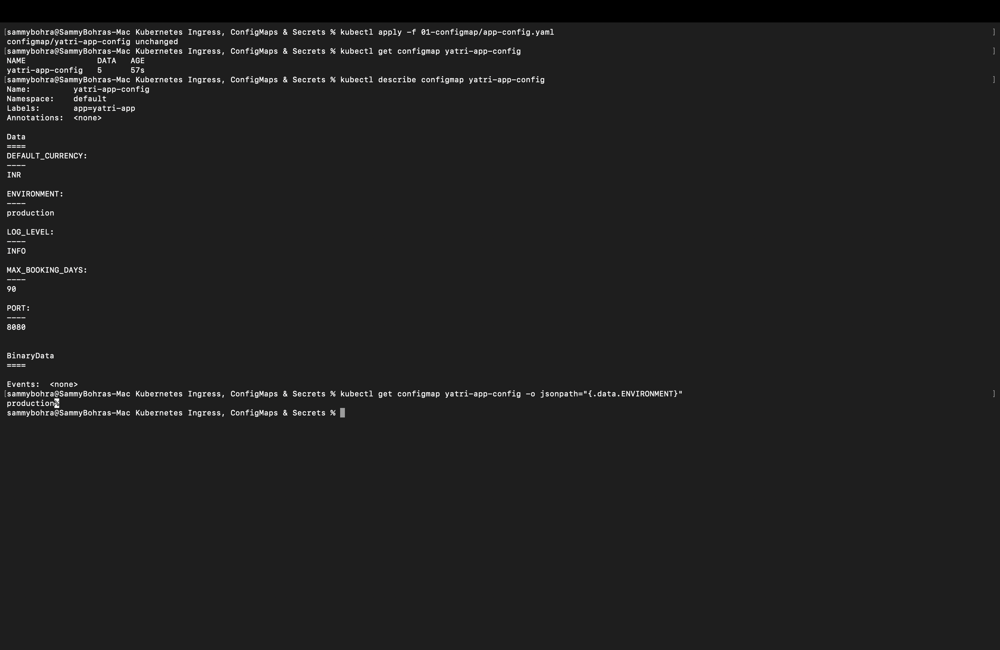

## 2 — ConfigMap live-update / Pod immobility
```
kubectl exec deploy/yatri-backend -- env | grep ENVIRONMENT   # production
kubectl patch configmap yatri-app-config --type merge --patch-file 01-configmap/patch-staging.json
kubectl get configmap yatri-app-config -o jsonpath="{.data.ENVIRONMENT}"   # staging
kubectl exec deploy/yatri-backend -- env | grep ENVIRONMENT   # still production!
kubectl rollout restart deployment/yatri-backend
kubectl exec deploy/yatri-backend -- env | grep ENVIRONMENT   # now staging
```
The ConfigMap changed instantly; the already-running Pod kept reading `production` from its own environment until `rollout restart` gave it a new Pod. Env vars are read once at container start — patching the object doesn't touch anything already running.

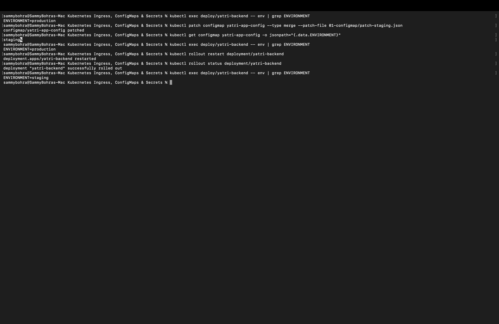

Reverted back to `production` for the rest of the tasks:
```
kubectl patch configmap yatri-app-config --type merge --patch-file 01-configmap/patch-production.json
kubectl rollout restart deployment/yatri-backend
```
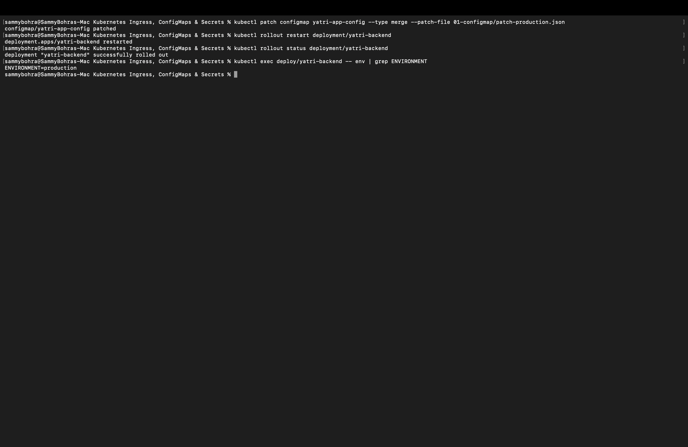

## 3 — Secret + base64 decode
```
kubectl apply -f 02-secret/db-secret.yaml   # unchanged
kubectl describe secret yatri-db-secret
```
`describe` only shows byte counts (`POSTGRES_PASSWORD: 14 bytes`, `POSTGRES_USER: 11 bytes`) — no values. But:
```
kubectl get secret yatri-db-secret -o jsonpath="{.data.POSTGRES_PASSWORD}" | base64 -d
```
prints `secretpassword` straight out. Base64 is an encoding, not encryption — `describe` masking the value is a display convention, not a real barrier.

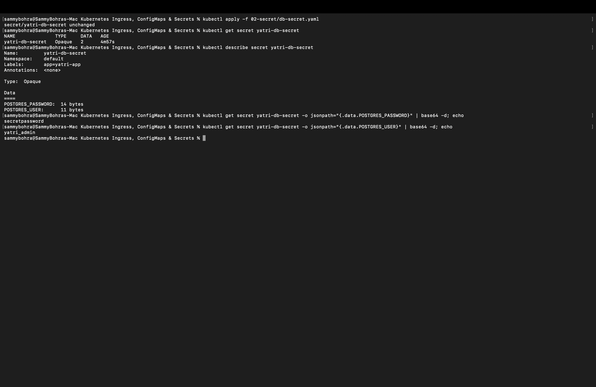

## 4 — the newline gotcha
```
echo "secretpassword" | xxd     # ends in 0a  <- extra byte!
echo "secretpassword" | base64  # c2VjcmV0cGFzc3dvcmQK
echo -n "secretpassword" | xxd  # no trailing byte
echo -n "secretpassword" | base64  # c2VjcmV0cGFzc3dvcmQ=
```
`echo` appends a newline by default, so a naively-encoded secret is 15 bytes instead of 14 and authentication would fail even though every YAML file looks correct. The `14 bytes` in Task 3's `describe` output was the sanity check that this Secret was encoded right (`echo -n`, not `echo`).

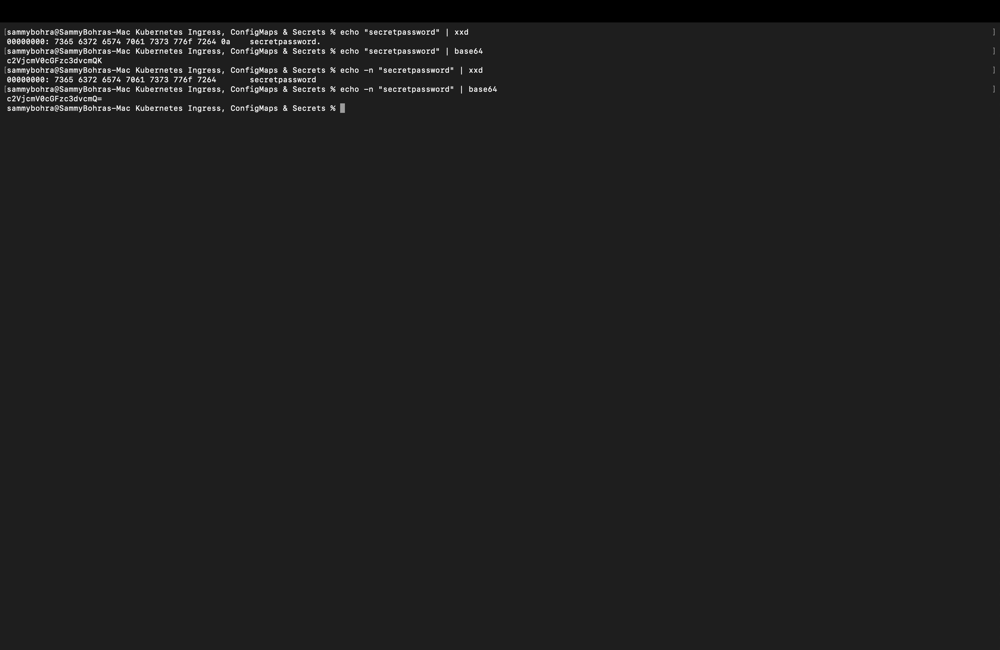

## 5 — no external secret manager here
```
kubectl get crds | grep -i secret
```
Nothing — this cluster only has native Kubernetes Secrets, no External Secrets Operator or Vault. Fine for a local lab; in production, committing Secret YAML to git is the real problem (base64 isn't encryption, and git history is permanent even after a "delete" commit). The real fix is an operator like ESO or Vault Agent that pulls from AWS/Azure/GCP secret managers and materializes an in-cluster Secret that's never in git.


## 6 — combined ConfigMap + Secret injection
```
kubectl exec deploy/yatri-backend -- env | grep -E "ENVIRONMENT|LOG_LEVEL|POSTGRES|DEFAULT_CURRENCY|MAX_BOOKING"
```
All 6 vars, two sources: 5 keys arrived in bulk via `envFrom.configMapRef`, the 2 `POSTGRES_*` keys were named individually via `env.valueFrom.secretKeyRef`. Inside the container they're indistinguishable — the split only exists at the object level (different RBAC, different review process).


## 7 — Ingress resource vs controller
```
kubectl api-resources | grep -i ingress
```
`ingresses` and `ingressclasses` are always registered API types, even with zero controllers installed. An Ingress with nothing watching it is just inert YAML — this is the standard trap where `kubectl apply` succeeds and nothing actually routes.


## 8 — enabling ingress-nginx
```
minikube addons enable ingress
kubectl wait --namespace ingress-nginx --for=condition=ready pod --selector=app.kubernetes.io/component=controller --timeout=120s
```
Controller Pod `1/1 Running`, the two `admission-*` Pods show `Completed` (they're one-shot cert-generation Jobs, not failures), `condition met`. Controller Service is NodePort `80:32088`, `443:30508`.

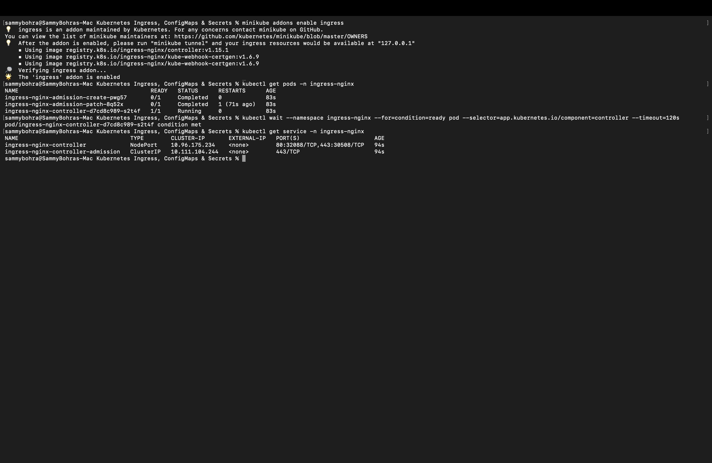

## 9 — hosts file + name resolution
```
minikube ssh -- 'echo "192.168.49.2  yatri.local portal.campus.local api.campus.local" | sudo tee -a /etc/hosts'
minikube ssh -- "curl -s http://yatri.local/ | grep -i title"     # nginx title
minikube ssh -- "curl -s http://yatri.local/api/"                 # backend config dump
```
Added the mapping on the node itself since `192.168.49.2` isn't reachable from the Mac host directly with the Docker driver. Same hostname served two completely different apps by path.

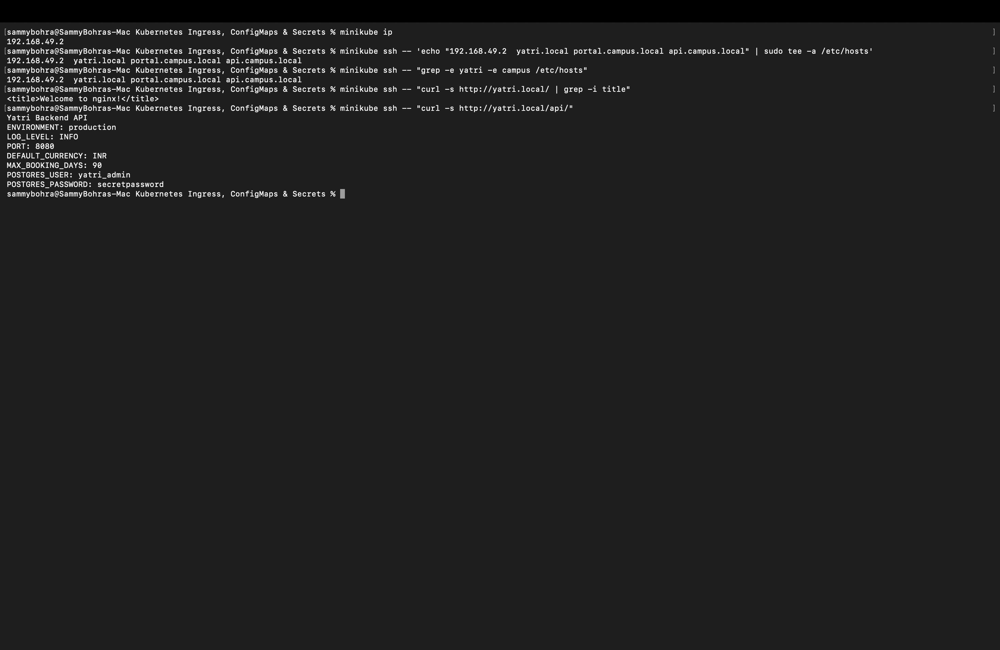

## 10 — path-based routing
`04-full-demo/ingress.yaml` routes `yatri.local/api(/|$)(.*)` → backend and `yatri.local/` → frontend, with `rewrite-target: /$2` stripping the `/api` prefix before it reaches the backend.
```
kubectl describe ingress yatri-ingress
```
Backends resolve to live Pod IPs (`10.244.0.23:8080`, `10.244.0.21:80`), not just Service names — an empty parenthesis there would mean a selector typo.

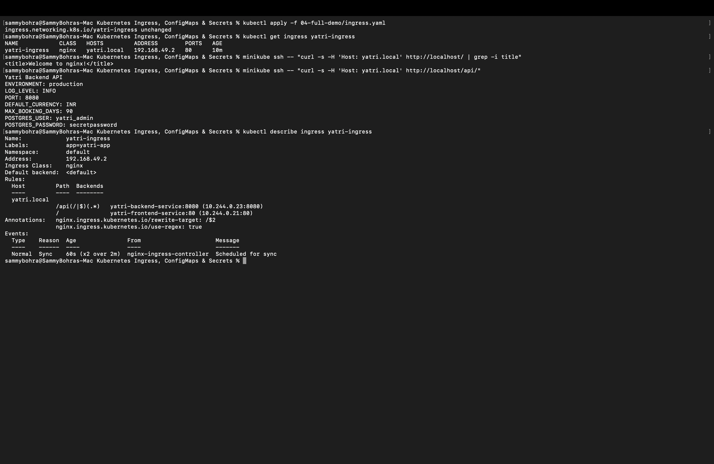

## 11 — host-based (subdomain) routing
```
minikube ssh -- "curl -k -s --resolve portal.campus.local:443:127.0.0.1 https://portal.campus.local/ | grep -i title"
minikube ssh -- "curl -k -s --resolve api.campus.local:443:127.0.0.1 https://api.campus.local/api/ | head -3"
```
Same IP, same controller, two completely different apps selected purely by the `Host` header — `portal.campus.local` hit the frontend, `api.campus.local` hit the backend. (Testing this before the TLS Secret existed returned a plain `404` — the Ingress simply didn't exist yet at that point.)

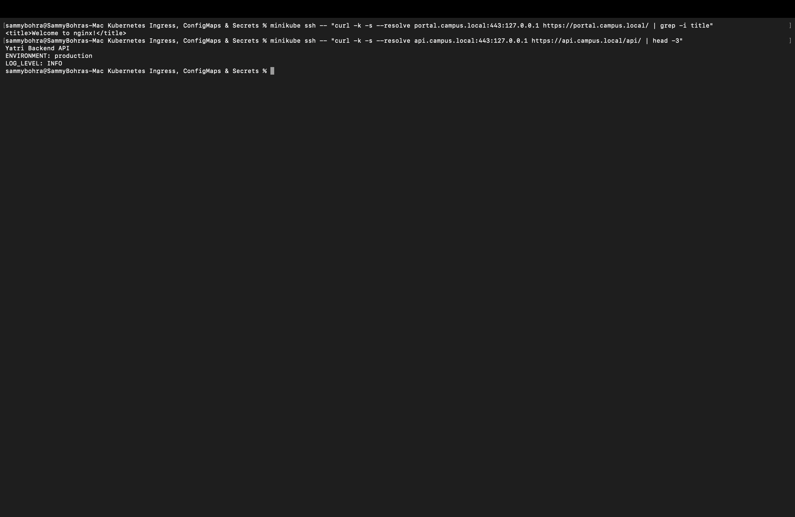

## 12 — hybrid routing
`03-ingress/ingress-tls.yaml` gives `portal.campus.local` and `api.campus.local` their own path tables inside one Ingress object.
```
kubectl get ingress campus-ingress-tls
```
`HOSTS` lists both virtual hosts, `PORTS` shows `80, 443` (the 443 only appears because a `tls:` block is present). `describe` shows a genuine two-level table: host first, then path within that host — `api.campus.local` has both a regex rule and a catch-all, `portal.campus.local` just the catch-all.

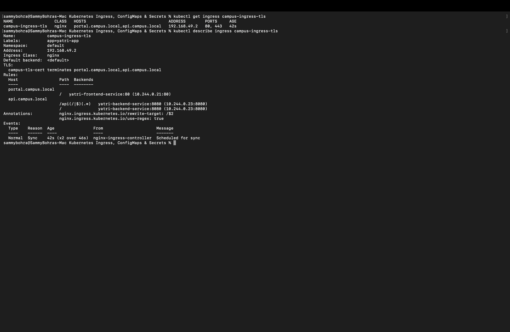

## 13 — TLS termination
```
openssl req -x509 -nodes -days 365 -newkey rsa:2048 \
  -keyout tls.key -out tls.crt \
  -subj "/CN=campus.local/O=CampusDevOps" \
  -addext "subjectAltName=DNS:campus.local,DNS:portal.campus.local,DNS:api.campus.local"
kubectl create secret tls campus-tls-cert --cert=tls.crt --key=tls.key
```
The Secret had already been created a minute earlier while getting Task 11 working, so re-running this for the screenshot correctly failed with `already exists` — left in as-is rather than cleaned up, since it's an honest side effect of doing the tasks slightly out of order.
```
openssl x509 -in 03-ingress/tls.crt -noout -subject -dates -ext subjectAltName
# subject=CN=campus.local, O=CampusDevOps
# X509v3 Subject Alternative Name: DNS:campus.local, DNS:portal.campus.local, DNS:api.campus.local
minikube ssh -- "curl -k -s -o /dev/null -w 'HTTP %{http_code}\n' --resolve portal.campus.local:443:127.0.0.1 https://portal.campus.local/"
# HTTP 200
```
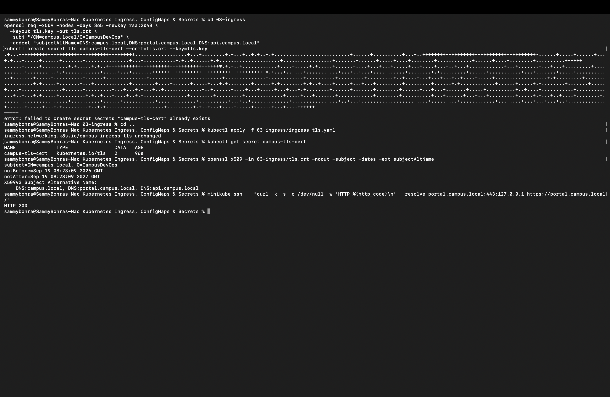

`HTTP 200` alone doesn't prove *our* cert is being served — ingress-nginx silently falls back to its own fake default cert if the SNI hostname isn't in the cert's SAN list. Checked the actual handshake:
```
minikube ssh -- "curl -k -sv --resolve portal.campus.local:443:127.0.0.1 https://portal.campus.local/ 2>&1 | grep -E 'subject:|issuer:|SSL connection'"
# SSL connection using TLSv1.3 / TLS_AES_256_GCM_SHA384
# subject: CN=campus.local; O=CampusDevOps
# issuer: CN=campus.local; O=CampusDevOps
```
Self-signed (subject == issuer), TLSv1.3, and it's genuinely our certificate being served — confirmed by checking the handshake, not just the status code.


## 14 — full-stack automation
```
bash 04-full-demo/run-demo.sh
kubectl get configmap,secret,ingress,deploy,svc,pods -l app=yatri-app
```
Every line came back `unchanged` — the stack was already fully deployed from the start of this session, which is exactly the point of `apply`-based scripts: safe to re-run. One label (`app=yatri-app`) audits all 6 resource kinds — 2 ConfigMap/Secret objects, 2 Ingresses, 2 Deployments (`1/1` each), 2 Services, 2 Pods, all `Running`.

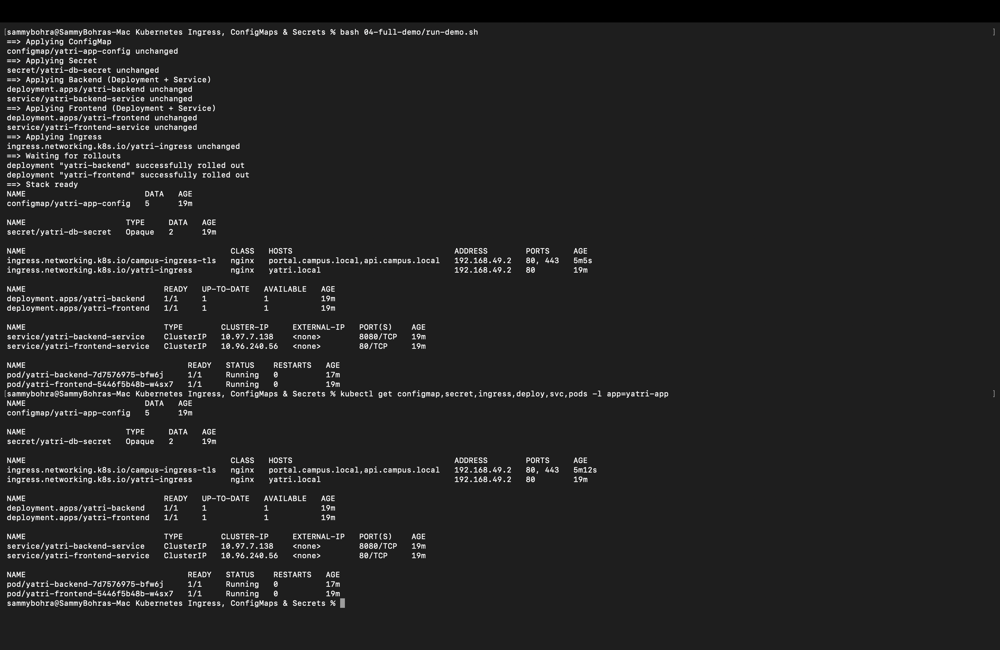

(`cleanup.sh` exists and works the same way as `run-demo.sh` in reverse, but wasn't run again for a fresh screenshot here since the stack needed to stay up.)
