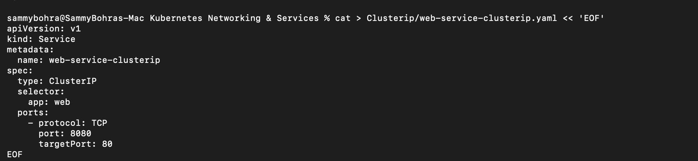
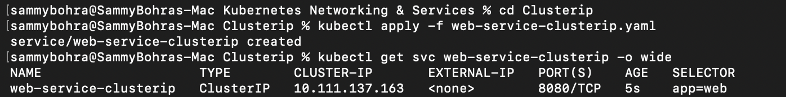
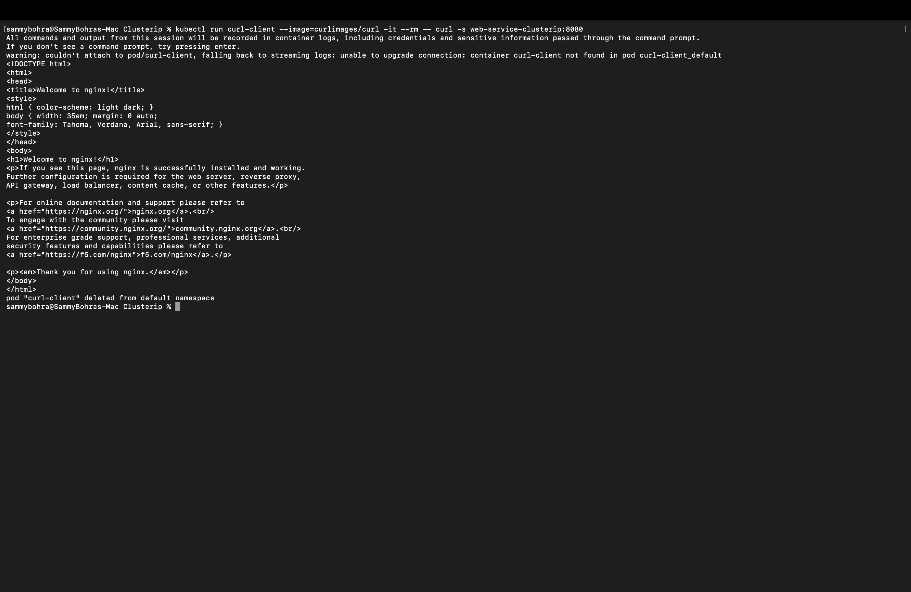

# ClusterIP Service

**ClusterIP** is the default Service type. It gets a virtual IP that can only be reached from **inside** the cluster, so it suits internal traffic between Pods (for example, frontend → backend).

Manifest: [`web-service-clusterip.yaml`](web-service-clusterip.yaml). It selects `app: web` and forwards port `8080` to container port `80`.

```yaml
apiVersion: v1
kind: Service
metadata:
  name: web-service-clusterip
spec:
  type: ClusterIP
  selector:
    app: web
  ports:
    - protocol: TCP
      port: 8080
      targetPort: 80
```



**Commands:**

```bash
kubectl apply -f web-service-clusterip.yaml
kubectl get svc web-service-clusterip -o wide
kubectl run curl-client --image=curlimages/curl -it --rm -- curl -s web-service-clusterip:8080
```

**Output:**

```
% kubectl apply -f web-service-clusterip.yaml
service/web-service-clusterip created

% kubectl get svc web-service-clusterip -o wide
NAME                     TYPE        CLUSTER-IP      EXTERNAL-IP   PORT(S)    AGE   SELECTOR
web-service-clusterip    ClusterIP   10.111.137.163  <none>        8080/TCP   5s    app=web

% kubectl run curl-client --image=curlimages/curl -it --rm -- curl -s web-service-clusterip:8080
<!DOCTYPE html>
<html>
<head>
<title>Welcome to nginx!</title>
...
<h1>Welcome to nginx!</h1>
<p>If you see this page, nginx is successfully installed and working...</p>
</html>
pod "curl-client" deleted from default namespace
```

**Result:** the Service got cluster IP `10.111.137.163` on port `8080`. The temporary `curl-client` Pod reached it purely by its in-cluster DNS name (`web-service-clusterip`) and got back the full Nginx welcome page HTML, proving ClusterIP routing and cluster DNS both work without exposing anything outside the cluster.



