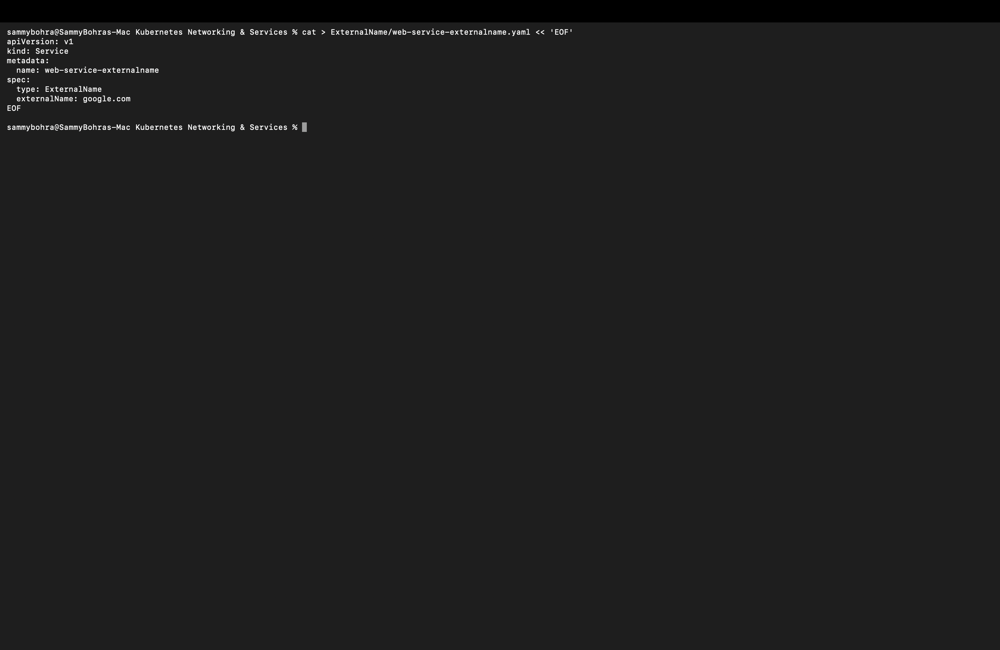
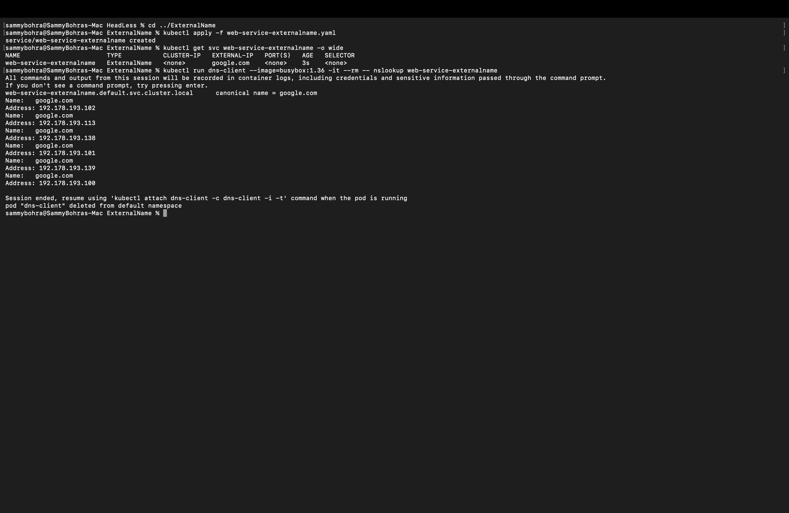

# ExternalName Service

An **ExternalName** Service maps a name inside the cluster to an **external DNS name** using a CNAME record. It has no selector, no Pods and no proxying. It lets apps use a stable in-cluster name for an outside dependency.

Manifest: [`web-service-externalname.yaml`](web-service-externalname.yaml). It points to `externalName: google.com` and has no selector.

```yaml
apiVersion: v1
kind: Service
metadata:
  name: web-service-externalname
spec:
  type: ExternalName
  externalName: google.com
```



**Commands:**

```bash
kubectl apply -f web-service-externalname.yaml
kubectl get svc web-service-externalname -o wide
kubectl run dns-client --image=busybox:1.36 -it --rm -- nslookup web-service-externalname
```

**Output:**

```
% kubectl apply -f web-service-externalname.yaml
service/web-service-externalname created

% kubectl get svc web-service-externalname -o wide
NAME                        TYPE           CLUSTER-IP   EXTERNAL-IP   PORT(S)   AGE   SELECTOR
web-service-externalname    ExternalName   <none>       google.com    <none>    3s    <none>

% kubectl run dns-client --image=busybox:1.36 -it --rm -- nslookup web-service-externalname
web-service-externalname.default.svc.cluster.local    canonical name = google.com
Name:   google.com
Address: 192.178.193.102
Name:   google.com
Address: 192.178.193.113
...
pod "dns-client" deleted from default namespace
```

**Result:** `TYPE` is `ExternalName` and `EXTERNAL-IP` shows `google.com` directly instead of an IP — there's no ClusterIP, no selector, and no Pods behind this Service at all. `nslookup` confirms cluster DNS answers with a CNAME (`canonical name = google.com`) and then resolves that name through regular public DNS, returning several of Google's real IPs. This is the one Service type where Kubernetes networking does nothing but rewrite a DNS name.


