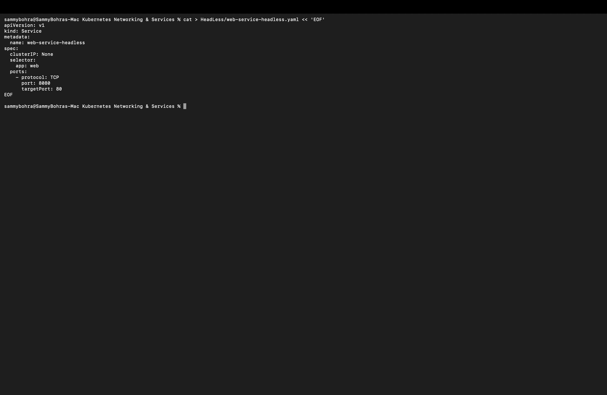
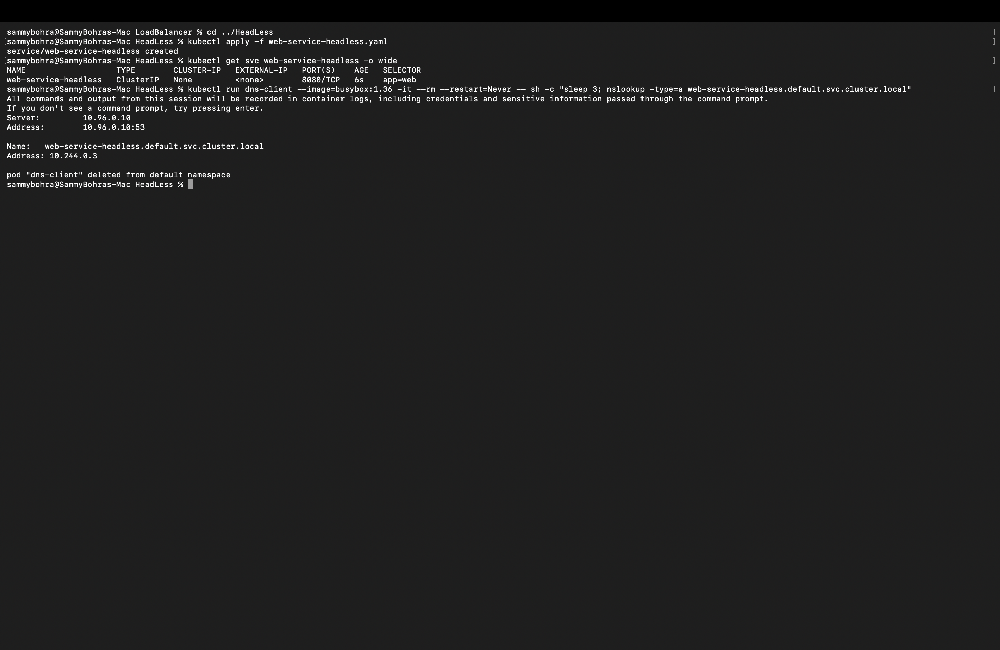

# Headless Service

A **Headless** Service sets `clusterIP: None`. It has no virtual IP and no kube-proxy load balancing. Instead, cluster DNS returns the **Pod IP directly**. StatefulSets (for example, databases) use this so clients can reach individual Pods.

Manifest: [`web-service-headless.yaml`](web-service-headless.yaml). It selects `app: web` on port `8080` and forwards to container port `80`.

```yaml
apiVersion: v1
kind: Service
metadata:
  name: web-service-headless
spec:
  clusterIP: None
  selector:
    app: web
  ports:
    - protocol: TCP
      port: 8080
      targetPort: 80
```



**Commands:**

```bash
kubectl apply -f web-service-headless.yaml
kubectl get svc web-service-headless -o wide
kubectl run dns-client --image=busybox:1.36 -it --rm --restart=Never -- sh -c "sleep 3; nslookup -type=a web-service-headless.default.svc.cluster.local"
```

**Output:**

```
% kubectl apply -f web-service-headless.yaml
service/web-service-headless created

% kubectl get svc web-service-headless -o wide
NAME                    TYPE        CLUSTER-IP   EXTERNAL-IP   PORT(S)    AGE   SELECTOR
web-service-headless    ClusterIP   None         <none>        8080/TCP   6s    app=web

% kubectl run dns-client --image=busybox:1.36 -it --rm --restart=Never -- sh -c "sleep 3; nslookup -type=a web-service-headless.default.svc.cluster.local"
Server:         10.96.0.10
Address:        10.96.0.10:53

Name:   web-service-headless.default.svc.cluster.local
Address: 10.244.0.3

pod "dns-client" deleted from default namespace
```

**Result:** `CLUSTER-IP` is `None` — no virtual Service IP was ever allocated. `nslookup` resolved `web-service-headless.default.svc.cluster.local` straight to `10.244.0.3`, the actual IP of the `web` Pod itself. Cluster DNS is answering directly with the Pod's address instead of routing through a proxy.

The lookup uses the fully qualified service name and asks only for A records, so busybox doesn't try other search domains or AAAA records. The `sleep 3` gives `kubectl` time to attach to the Pod before `nslookup` runs.


