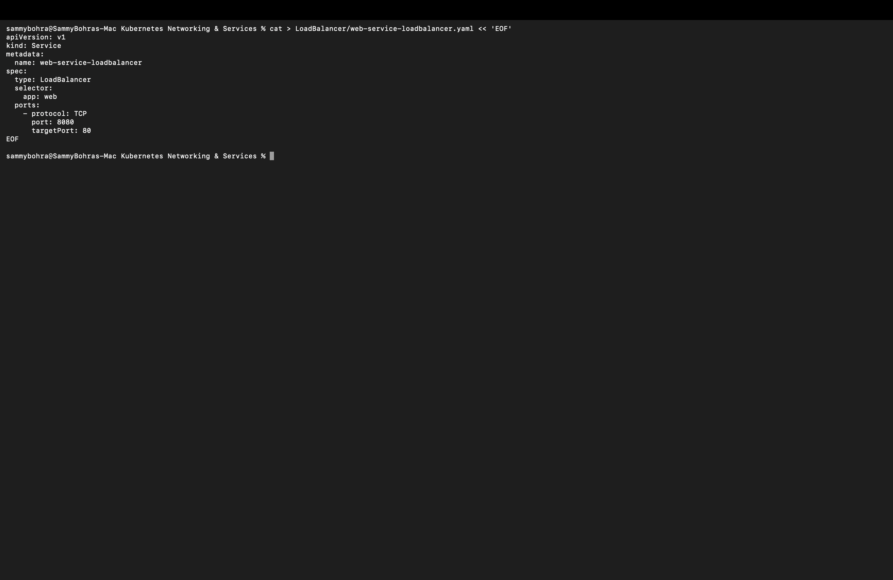
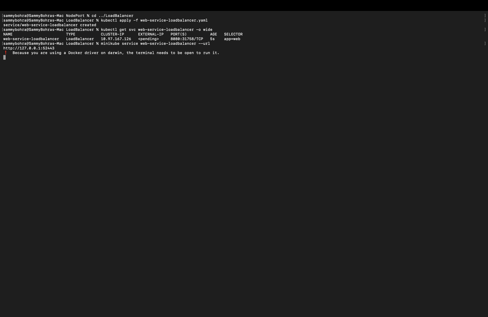
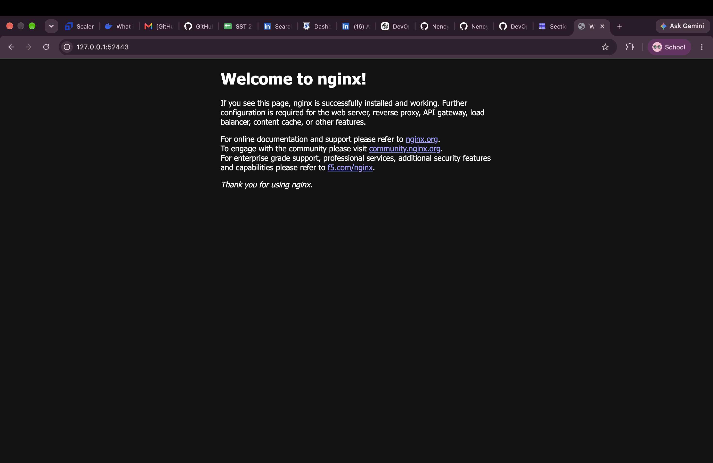

# LoadBalancer Service

**LoadBalancer** asks the cloud provider for an external load balancer with a public IP. It builds on NodePort and ClusterIP under the hood — Kubernetes still allocates a node port even though we didn't specify one.

Manifest: [`web-service-loadbalancer.yaml`](web-service-loadbalancer.yaml). It maps port `8080` to container port `80`.

```yaml
apiVersion: v1
kind: Service
metadata:
  name: web-service-loadbalancer
spec:
  type: LoadBalancer
  selector:
    app: web
  ports:
    - protocol: TCP
      port: 8080
      targetPort: 80
```



**Commands:**

```bash
kubectl apply -f web-service-loadbalancer.yaml
kubectl get svc web-service-loadbalancer -o wide
minikube service web-service-loadbalancer --url
```

**Output:**

```
% kubectl apply -f web-service-loadbalancer.yaml
service/web-service-loadbalancer created

% kubectl get svc web-service-loadbalancer -o wide
NAME                       TYPE           CLUSTER-IP     EXTERNAL-IP   PORT(S)          AGE   SELECTOR
web-service-loadbalancer   LoadBalancer   10.97.167.126  <pending>     8080:31758/TCP   5s    app=web

% minikube service web-service-loadbalancer --url
http://127.0.0.1:52443
❗  Because you are using a Docker driver on darwin, the terminal needs to be open to run it.
```

**Result:** Minikube has no real cloud provider behind it, so `EXTERNAL-IP` stays `<pending>` — no IP was faked to fill that column, and it would only resolve if `minikube tunnel` were running separately. Kubernetes still auto-assigned a node port (`31758`) as the fallback path into the Pod. `minikube service --url` opened a local tunnel at `http://127.0.0.1:52443`, and the Nginx welcome page loaded there in the browser.



