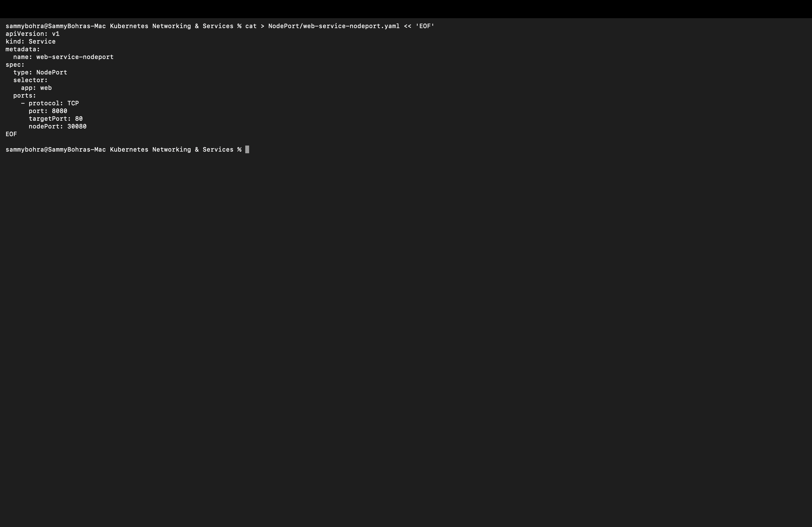
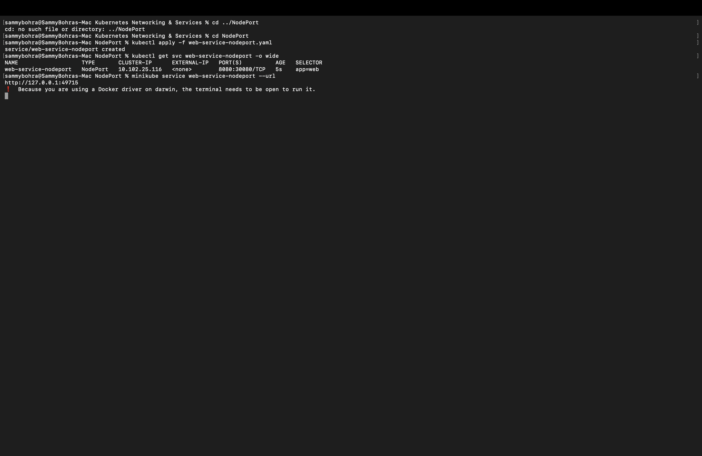
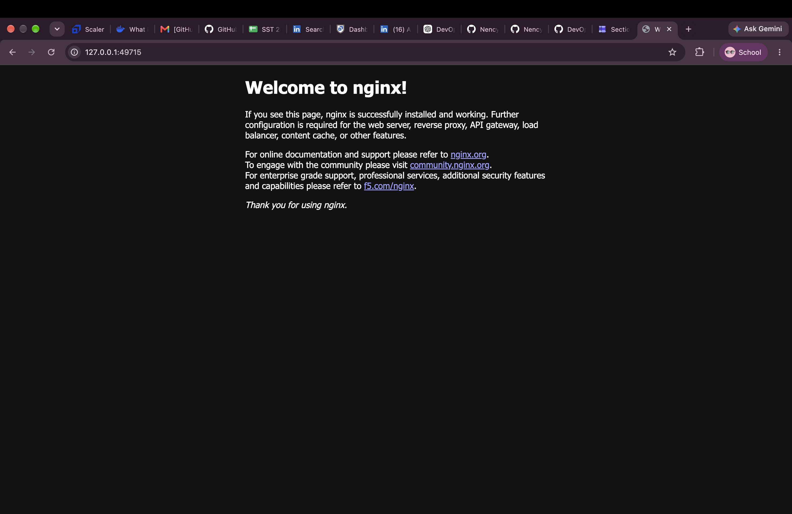

# NodePort Service

**NodePort** opens a fixed port (30000–32767) on every node, so the app can be reached from **outside** the cluster at `<NodeIP>:<nodePort>`. It also gets a ClusterIP.

Manifest: [`web-service-nodeport.yaml`](web-service-nodeport.yaml). It maps port `8080` to container port `80`, with node port `30080`.

```yaml
apiVersion: v1
kind: Service
metadata:
  name: web-service-nodeport
spec:
  type: NodePort
  selector:
    app: web
  ports:
    - protocol: TCP
      port: 8080
      targetPort: 80
      nodePort: 30080
```



**Commands:**

```bash
kubectl apply -f web-service-nodeport.yaml
kubectl get svc web-service-nodeport -o wide
minikube service web-service-nodeport --url
```

**Output:**

```
% kubectl apply -f web-service-nodeport.yaml
service/web-service-nodeport created

% kubectl get svc web-service-nodeport -o wide
NAME                   TYPE       CLUSTER-IP      EXTERNAL-IP   PORT(S)          AGE   SELECTOR
web-service-nodeport   NodePort   10.102.25.116   <none>        8080:30080/TCP   5s    app=web

% minikube service web-service-nodeport --url
http://127.0.0.1:49715
❗  Because you are using a Docker driver on darwin, the terminal needs to be open to run it.
```

**Result:** `PORT(S)` shows `8080:30080/TCP`. Minikube on macOS with the Docker driver can't route directly to the node IP, so `minikube service --url` opened a local tunnel at `http://127.0.0.1:49715` and kept the terminal blocked to keep it alive. Opening that URL in the browser loaded the Nginx welcome page.



