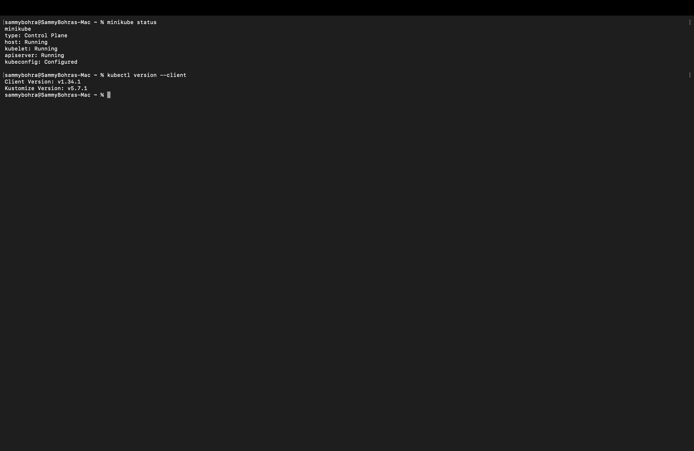
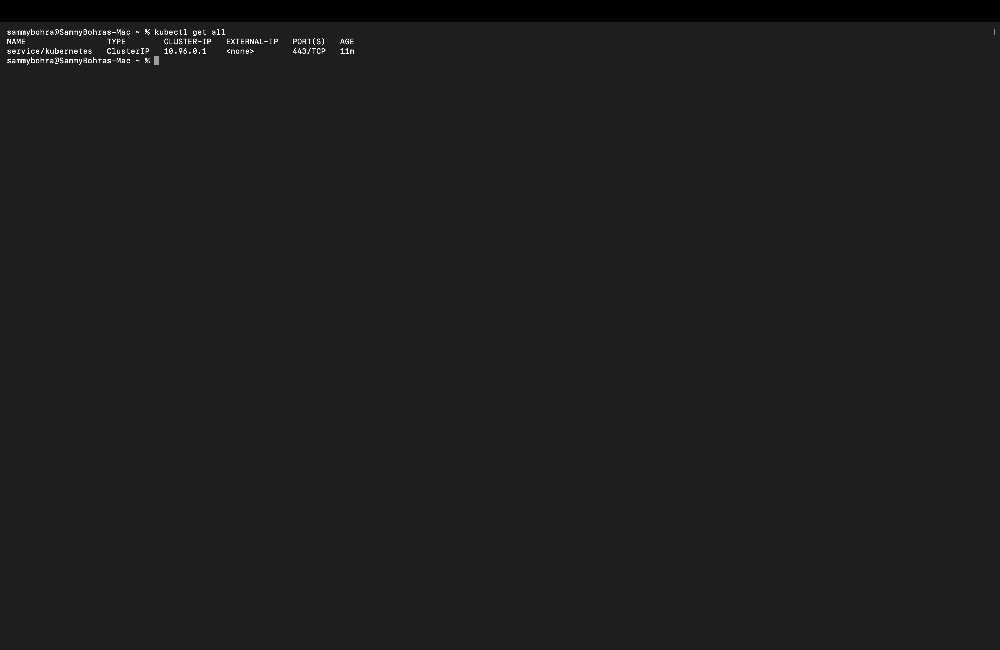
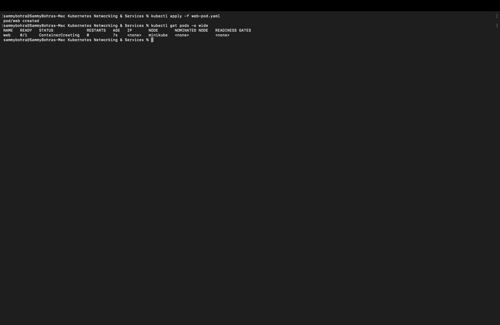
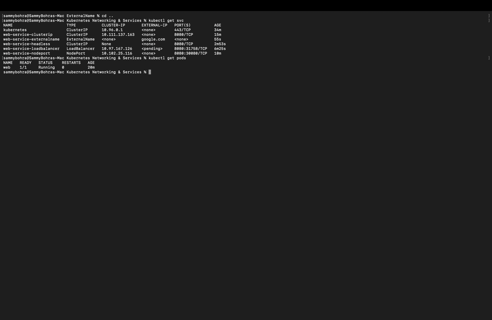

# Session 11 — Kubernetes Services

**Author:** Sambhav D Bohra
**Enrollment number:** 24BCS10090

All five Service types were run on a Minikube cluster (Docker driver, Kubernetes v1.37.0) on macOS (arm64). Every Service except ExternalName points to **one** Nginx Pod named `web` (label `app: web`).

| Service | Type | How it was verified |
|---|---|---|
| [web-service-clusterip](Clusterip/) | ClusterIP `10.111.137.163` | `curl` from a temporary Pod inside the cluster returned the Nginx page |
| [web-service-nodeport](NodePort/) | NodePort `8080:30080` | `minikube service --url` → tunnel → Nginx page opened in the browser |
| [web-service-loadbalancer](LoadBalancer/) | LoadBalancer `8080:31758` | `EXTERNAL-IP` stayed `<pending>` (no cloud provider); `minikube service --url` → Nginx page opened in the browser |
| [web-service-headless](HeadLess/) | ClusterIP `None` | `nslookup` returned the Pod IP (`10.244.0.3`) directly |
| [web-service-externalname](ExternalName/) | ExternalName → `google.com` | `nslookup` returned a CNAME to `google.com`, resolving to Google's real IPs |

## Pod

[`web-pod.yaml`](web-pod.yaml)

```yaml
apiVersion: v1
kind: Pod
metadata:
  name: web
  labels:
    app: web
spec:
  containers:
    - name: web
      image: nginx
      ports:
        - containerPort: 80
```

```
% kubectl apply -f web-pod.yaml
pod/web created

% kubectl get pods -o wide
NAME   READY   STATUS              RESTARTS   AGE   IP       NODE       NOMINATED NODE   READINESS GATES
web    0/1     ContainerCreating   0          7s    <none>   minikube   <none>           <none>
```





## Final state

After all five Services were created, `kubectl get svc` and `kubectl get pods` confirm every one of them alongside the single running `web` Pod:

```
% kubectl get svc
NAME                       TYPE           CLUSTER-IP       EXTERNAL-IP   PORT(S)          AGE
kubernetes                 ClusterIP      10.96.0.1        <none>        443/TCP          34m
web-service-clusterip      ClusterIP      10.111.137.163   <none>        8080/TCP         15m
web-service-externalname   ExternalName   <none>           google.com    <none>           55s
web-service-headless       ClusterIP      None             <none>        8080/TCP         2m53s
web-service-loadbalancer   LoadBalancer   10.97.167.126    <pending>     8080:31758/TCP   6m25s
web-service-nodeport       NodePort       10.102.25.116    <none>        8080:30080/TCP   10m

% kubectl get pods
NAME   READY   STATUS    RESTARTS   AGE
web    1/1     Running   0          20m
```


