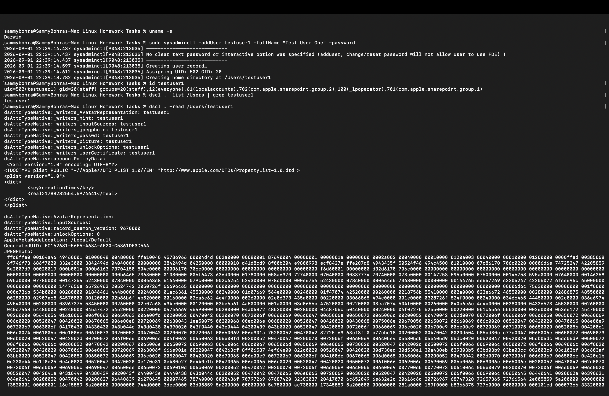
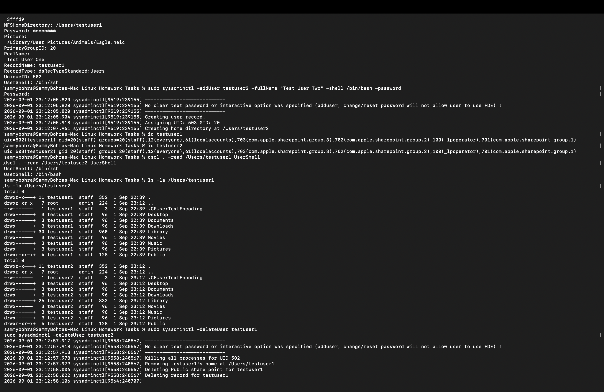
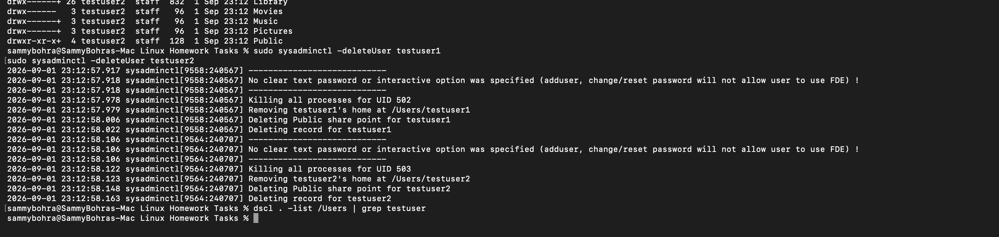

# Task 2: adduser vs useradd

## adduser 
- This user friendly 
- Automatically ask for name, password and all 

## useradd
- More basic/low-level
- You need to specify options yourself

---

## Screenshots

