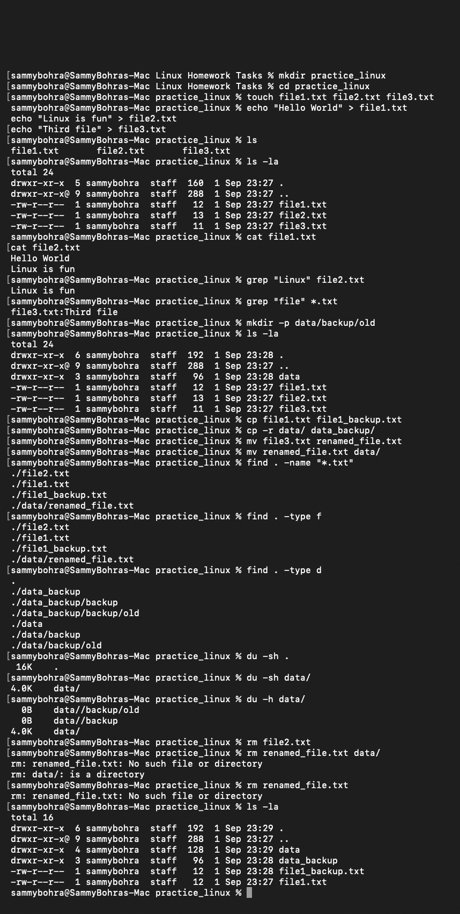

# Task 4: Linux Commands

## Practice Folder: `practice_linux`
The `practice_linux` folder has been created at `~/practice_linux` 

---

# ====== STEP 1: Setup ======
mkdir practice_linux
# Creates a folder named practice_linux for practicing commands

cd practice_linux
# Navigates into the practice_linux folder

# ====== STEP 2: Create Files ======
touch file1.txt file2.txt file3.txt
# Creates 3 empty text files

echo "Hello World" > file1.txt
# Writes "Hello World" into file1.txt (overwrites if exists)

echo "Linux is fun" > file2.txt
# Writes "Linux is fun" into file2.txt

echo "Third file" > file3.txt
# Writes "Third file" into file3.txt

# ====== STEP 3: List Files ======
ls
# Shows simple list of files in current directory

ls -la
# Shows detailed list with permissions, ownership, hidden files

# ====== STEP 4: View File Contents ======
cat file1.txt
# Displays content of file1.txt

cat file2.txt
# Displays content of file2.txt

# ====== STEP 5: Search in Files ======
grep "Linux" file2.txt
# Searches for word "Linux" in file2.txt

grep "file" *.txt
# Searches for word "file" in all .txt files

# ====== STEP 6: Create Nested Folders ======
mkdir -p data/backup/old
# Creates nested folders: data/backup/old (creates parent directories if needed)

# ====== STEP 7: Copy Files ======
cp file1.txt file1_backup.txt
# Copies file1.txt and names it file1_backup.txt

cp -r data/ data_backup/
# Copies entire data folder recursively (-r flag) to data_backup folder

# ====== STEP 8: Move/Rename Files ======
mv file3.txt renamed_file.txt
# Renames file3.txt to renamed_file.txt

mv renamed_file.txt data/
# Moves renamed_file.txt into data folder

# ====== STEP 9: Find Files ======
find . -name "*.txt"
# Finds all .txt files in current directory and subdirectories

find . -type f
# Finds all files (regular files) in current directory

find . -type d
# Finds all directories in current directory

# ====== STEP 10: Check Folder Size ======
du -sh .
# Shows total size of current folder (human-readable format)

du -sh data/
# Shows total size of data folder only

du -h data/
# Shows size of all items inside data folder with details

# ====== STEP 11: Remove Files ======
rm file2.txt
# Removes file2.txt

rm renamed_file.txt data/
# Removes files in data folder (note: may need -r flag for directories)

# ====== STEP 12: Verify Cleanup ======
ls -la
# Lists all files to verify deletion was successful

---

## Screenshots

