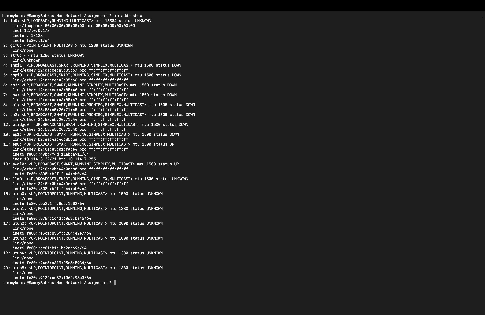
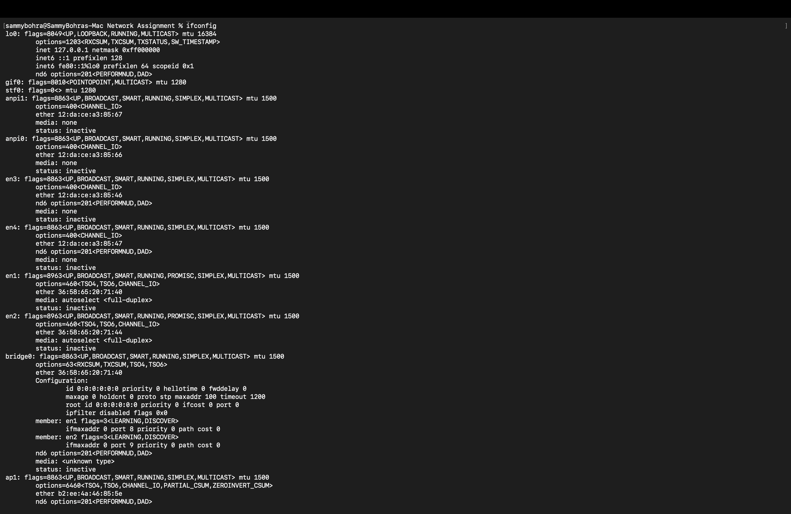
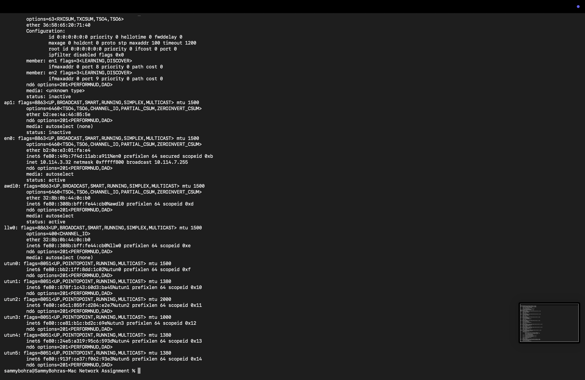
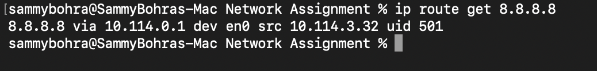
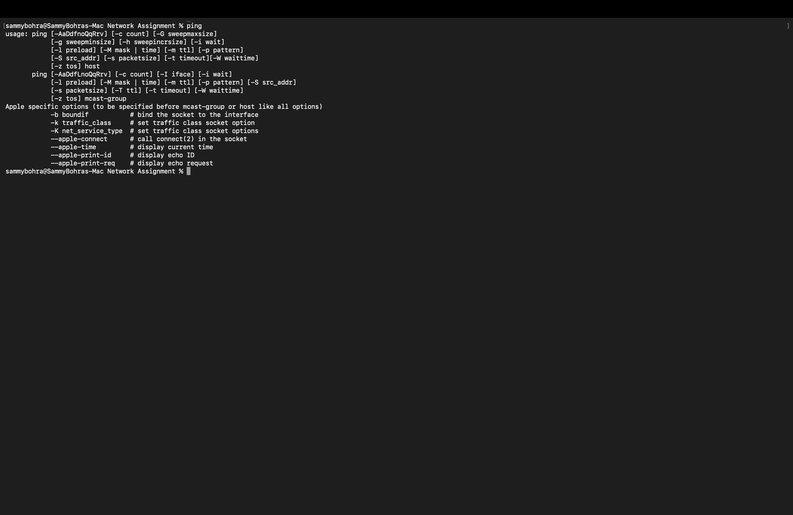
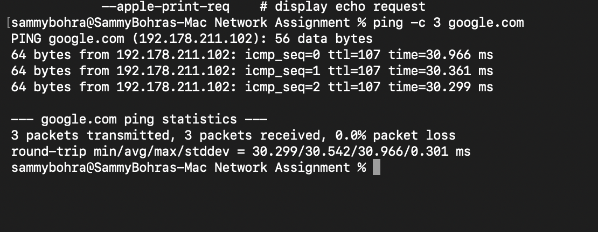
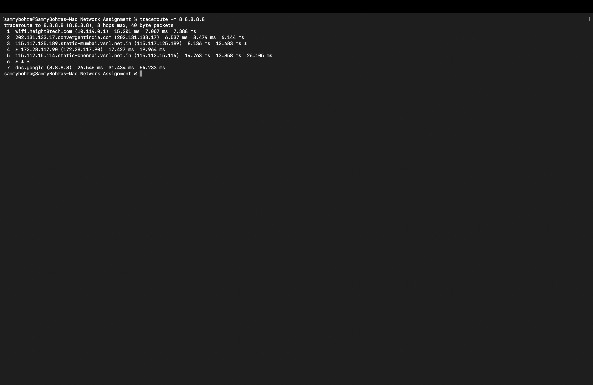
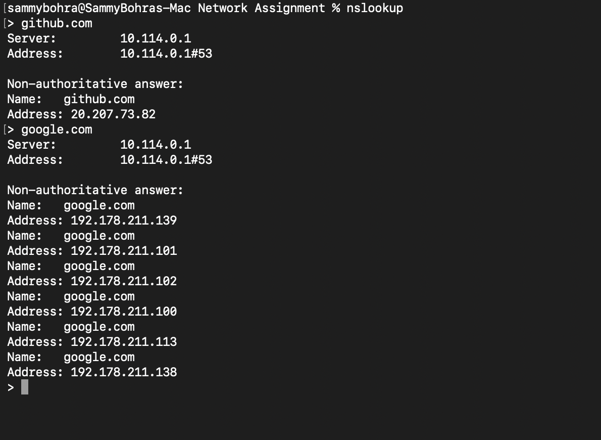
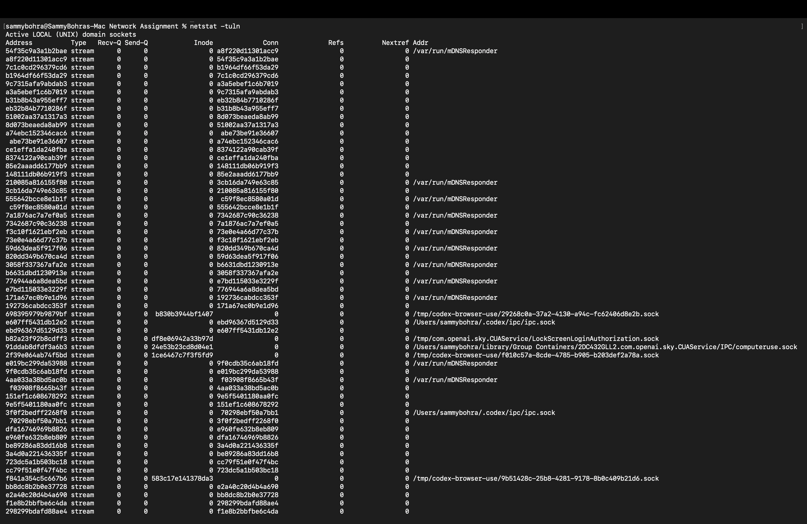

 # Networking Homework

I ran the networking commands on my Mac and added the screenshots below as proof of the results. The main interface used for the connection was `en0`, with IP address `10.114.3.32` and gateway `10.114.0.1`.

## 1. Network Interfaces

The `ip addr show` command displays all network interfaces and their addresses. The loopback interface `lo0` uses `127.0.0.1`, while `en0` is the active network interface with the local address `10.114.3.32`.

The older `ifconfig` command shows similar information, including interface status, MAC addresses, MTU, and whether an interface is active. In my output, `en0` is active and the other listed interfaces are inactive.

## 2. Routing

`ip route show` displays the routes used by the system. The default route sends traffic through `10.114.0.1` using `en0`.

`ip route get 8.8.8.8` confirms the exact route selected for Google's DNS server. The traffic uses gateway `10.114.0.1` and the source address `10.114.3.32`.

## 3. Connectivity Testing

The `ping` command checks whether a host responds to ICMP requests. One screenshot shows the command help because `ping` was entered without a destination.

I then tested Google with `ping -c 3 google.com`. All three packets were received, resulting in `0.0% packet loss`, with an average response time of about `30.542 ms`.

## 4. Tracing the Network Path

`traceroute -m 8 8.8.8.8` shows the path from my computer to Google's DNS server. The output reached seven hops, beginning with the local gateway and ending at `dns.google`.

## 5. DNS Resolution

DNS converts domain names into IP addresses. With `dig`, GitHub resolved to `20.207.73.82`, and the MX lookup for Google returned `smtp.google.com`.

`host github.com` also returned the GitHub IP address and its mail server.

Using `nslookup`, I checked both GitHub and Google. The DNS server used was `10.114.0.1`, and Google returned several IPv4 addresses.

## 6. Network Connections and Ports

`nc -zv github.com 443` checks whether GitHub's HTTPS port is reachable. The connection succeeded, which means TCP port 443 was open and reachable from my machine.

The `netstat -tuln` command displayed local UNIX-domain socket connections on this Mac. This is useful for seeing local communication endpoints, although this particular output does not show an open internet-facing TCP port.

## 7. Neighbour Discovery

`ip neigh show` displays the neighbour table, which maps local IP addresses to MAC addresses. The output contains reachable and stale entries on `en0`; these are devices that the computer has recently communicated with on the local network.

## 8. WHOIS Lookup

The `whois github.com` command returned registry information. The result identifies the `.COM` registry as VeriSign Global Registry Services and shows that the query was referred to another WHOIS server for more details.

## What I Learned

These commands helped me look at networking from different levels. Interface and route commands showed how my Mac connects to the network, DNS commands showed how names become IP addresses, and `ping`, `traceroute`, and `nc` helped me test reachability. The most useful result was combining these checks: first confirm the interface and route, then verify DNS, and finally test the required port or service.
