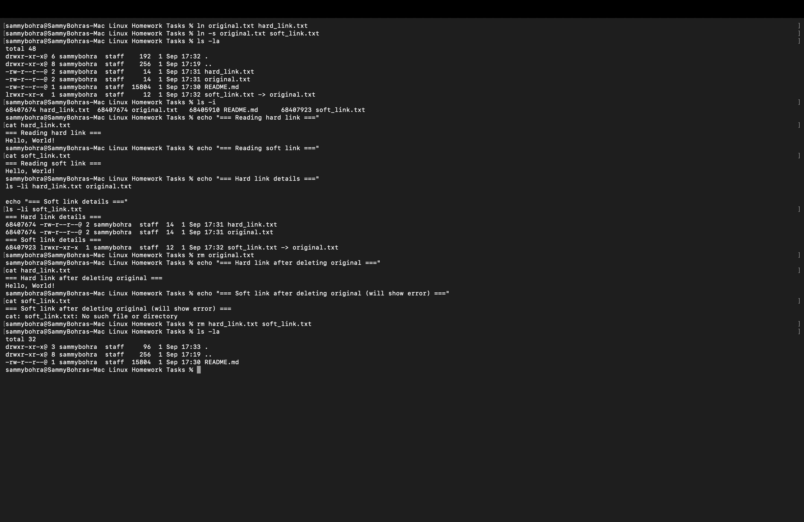
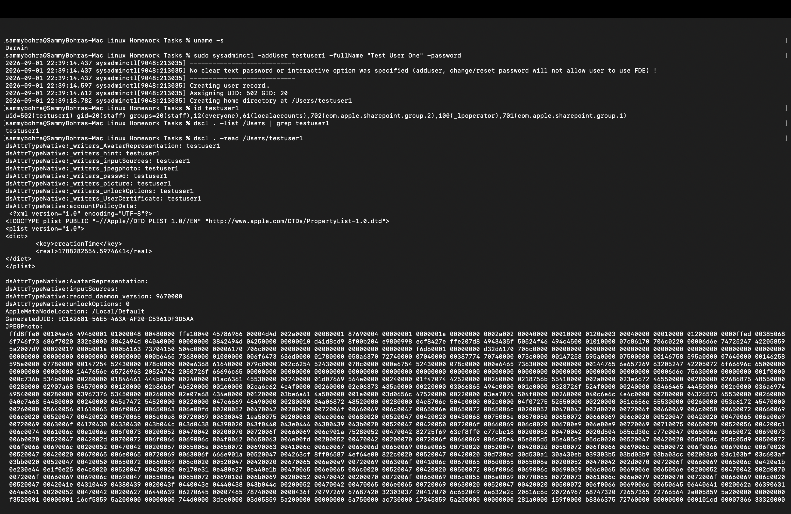
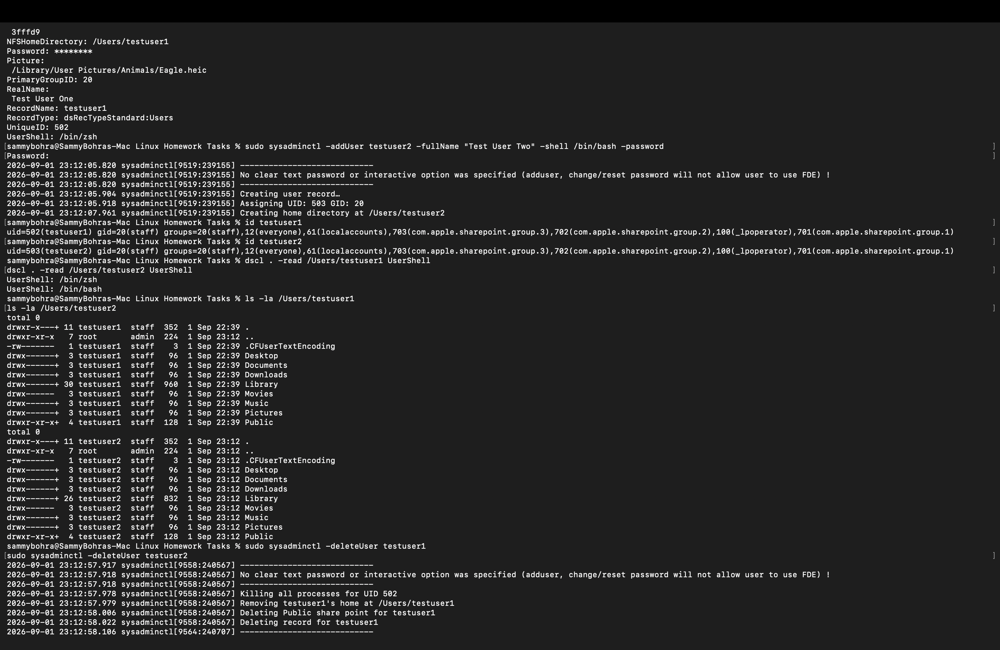
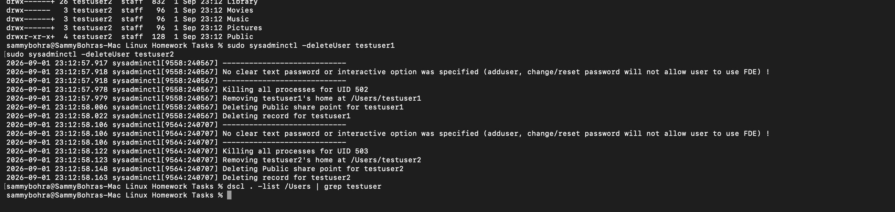
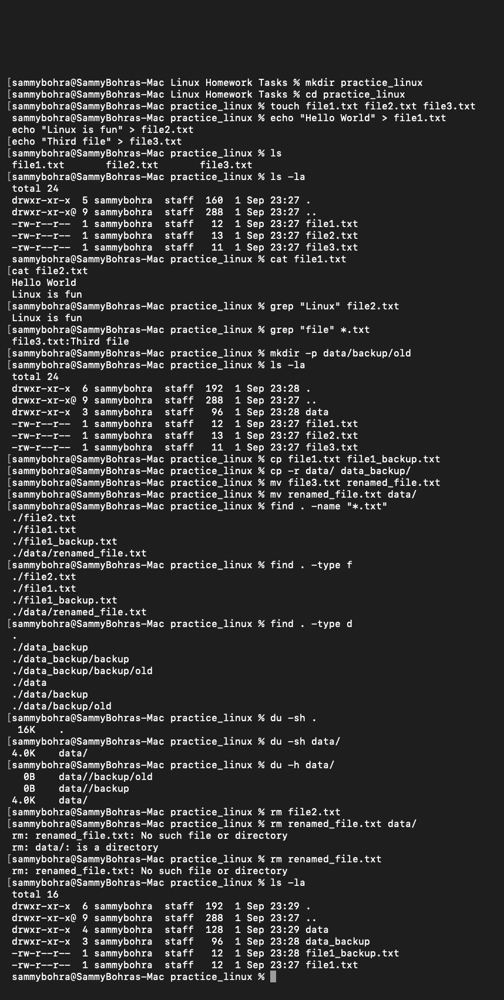

# Session 01 & 02: Linux Fundamentals & System Administration

This repository module contains hands-on practical lab exercises, system administration tasks, terminal diagnostic workflows, and core operating system fundamentals covering Linux and POSIX-compliant environments (Linux & macOS/Darwin).

---

## Student Information

| Field | Detail |
|---|---|
| **Student Name** | Sambhav D Bohra |
| **Registration / Enrollment Number** | 24bcs10090 |
| **Course** | DevOps & Cloud Engineering |
| **Module** | Sessions 01 & 02 — Linux Fundamentals |

---

## Table of Contents

1. [Session Overview](#session-overview)
2. [Task 1 — Hard Links vs. Soft (Symbolic) Links](#task-1--hard-links-vs-soft-symbolic-links)
   - [Core Concepts & Inode Architecture](#core-concepts--inode-architecture)
   - [Comparison Matrix](#comparison-matrix)
   - [Hands-on Terminal Workflow & Verification](#hands-on-terminal-workflow--verification)
   - [Visual Evidence](#visual-evidence-task-1)
3. [Task 2 — User Management: `adduser` vs. `useradd` & macOS Administration](#task-2--user-management-adduser-vs-useradd--macos-administration)
   - [Linux User Management: `adduser` vs. `useradd`](#linux-user-management-adduser-vs-useradd)
   - [macOS Practical Implementation (`sysadminctl` & `dscl`)](#macos-practical-implementation-sysadminctl--dscl)
   - [User Lifecycle Operations](#user-lifecycle-operations)
   - [Visual Evidence](#visual-evidence-task-2)
4. [Task 3 — System Logging & Auditing: `journalctl` vs. macOS `log`](#task-3--system-logging--auditing-journalctl-vs-macos-log)
   - [Linux System Logging with `journalctl`](#linux-system-logging-with-journalctl)
   - [macOS Unified Logging System (`log`)](#macos-unified-logging-system-log)
   - [Core Log Query & Filtering Commands](#core-log-query--filtering-commands)
5. [Task 4 — Linux File & Directory Management Lab (`practice_linux`)](#task-4--linux-file--directory-management-lab-practice_linux)
   - [Commands Reference Table](#commands-reference-table)
   - [Step-by-Step Lab Execution (Steps 1–12)](#step-by-step-lab-execution-steps-112)
   - [Visual Evidence](#visual-evidence-task-4)
6. [Key DevOps Engineering Takeaways](#key-devops-engineering-takeaways)

---

## Session Overview

Linux serves as the foundational operating system for cloud computing, container runtimes (Docker/Kubernetes), CI/CD build agents, and automated infrastructure. This module covers core system internals including:
- **Filesystem & Inode Management**: How files, metadata, and link references are indexed in the filesystem table.
- **Access Control & Identity Management**: Principles of least privilege, multi-user environments, UID/GID allocation, and permission flags.
- **System Telemetry & Audit Logs**: Querying kernel and user-space service events for root-cause diagnosis.
- **File System Operations**: Recursive directory handling, stream redirections, pattern searching (`grep`), and file discovery (`find`).

---

## Task 1 — Hard Links vs. Soft (Symbolic) Links

### Core Concepts & Inode Architecture

In Unix-like filesystems, a file consists of:
1. **Data Blocks**: The actual contents stored on disk.
2. **Inode (Index Node)**: A data structure storing metadata (permissions, owner, file size, timestamps, data block pointers, and reference link count).
3. **Directory Entry (dentry)**: A filename that maps to a specific Inode number.

```
                    +--------------------------------+
                    |           Inode 68407674       |
                    | (Metadata, Link Count: 2, etc) |
                    +--------------------------------+
                              ^            ^
                             /              \
        +-----------------------+        +---------------------+
        |     original.txt      |        |    hard_link.txt    |
        | (Points to Inode)     |        | (Points to Inode)   |
        +-----------------------+        +---------------------+

                    +--------------------------------+
                    |           Inode 68407923       |
                    | (Contains path: "original.txt")|
                    +--------------------------------+
                              ^
                             /
        +-----------------------+
        |     soft_link.txt     |
        | (Points to Path)      |
        +-----------------------+
```

### Comparison Matrix

| Feature | Hard Link (`ln target link`) | Soft / Symbolic Link (`ln -s target link`) |
|---|---|---|
| **Definition** | An additional directory entry pointing directly to the **same inode**. | A separate file containing a text path reference to the target file. |
| **Inode Number** | **Identical** to the original file inode. | **Unique**, has its own independent inode. |
| **Link Count** | Increments the inode link count by 1. | Does not change target file's link count. |
| **If Original File Deleted** | **Data is preserved**; file remains accessible via the hard link until all links reach 0. | **Broken link (dangling pointer)**; fails with `No such file or directory`. |
| **Cross-Filesystem Support** | ❌ No (inodes are unique per filesystem/partition). | ✅ Yes (points to a path string). |
| **Directory Linking** | ❌ No (prevents infinite recursive filesystem loops). | ✅ Yes (can link directories). |
| **File Permissions** | Mirrors the original file (shares same inode). | Displays `lrwxrwxrwx`, but access is governed by the target file. |

### Hands-on Terminal Workflow & Verification

1. **Create Target File & Links:**
   ```bash
   echo "Hello, World!" > original.txt
   ln original.txt hard_link.txt
   ln -s original.txt soft_link.txt
   ```

2. **Inspect Inodes & Link Metadata:**
   ```bash
   ls -li original.txt hard_link.txt soft_link.txt
   ```
   *Terminal Output:*
   ```text
   68407674 -rw-r--r--  2 sammybohra  staff  14 Sep  1 17:31 hard_link.txt
   68407674 -rw-r--r--  2 sammybohra  staff  14 Sep  1 17:31 original.txt
   68407923 lrwxr-xr-x  1 sammybohra  staff  12 Sep  1 17:32 soft_link.txt -> original.txt
   ```
   - Notice `original.txt` and `hard_link.txt` share Inode `68407674` with link count `2`.
   - `soft_link.txt` has its own Inode `68407923` and points to `original.txt`.

3. **Verify Read Operations:**
   ```bash
   cat hard_link.txt   # Output: Hello, World!
   cat soft_link.txt   # Output: Hello, World!
   ```

4. **Delete Original File & Test Resilience:**
   ```bash
   rm original.txt
   cat hard_link.txt   # Output: Hello, World! (Data block persists)
   cat soft_link.txt   # Output: cat: soft_link.txt: No such file or directory (Broken link)
   ```

### Visual Evidence (Task 1)



---

## Task 2 — User Management: `adduser` vs. `useradd` & macOS Administration

### Linux User Management: `adduser` vs. `useradd`

| Criterion | `adduser` (High-Level Utility) | `useradd` (Low-Level Binary) |
|---|---|---|
| **Architecture** | High-level interactive Perl wrapper (Debian/Ubuntu). | Standard low-level native compiled C binary. |
| **Interaction** | Interactive: prompts for password, full name, room number, phone. | Non-interactive: requires flags or default configuration. |
| **Home Directory** | Automatically creates `/home/username` and copies `/etc/skel`. | Does **not** create a home directory by default unless `-m` is specified. |
| **Default Shell** | Sets standard login shell (e.g., `/bin/bash`). | Uses system default (often `/bin/sh` or `/bin/false`) unless `-s` is specified. |
| **Automation / Scripts** | Unsuitable for automated CI/CD pipelines (blocks on prompt). | Ideal for automated scripts, Dockerfiles, and provisioning tools. |

### macOS Practical Implementation (`sysadminctl` & `dscl`)

On macOS (Darwin), local directory management uses OpenDirectory (`dscl`) and system administration controls (`sysadminctl`) rather than `/etc/passwd` file editing:

#### 1. Creating Users
```bash
# Create testuser1
sudo sysadminctl -addUser testuser1 -fullName "Test User One" -password

# Create testuser2 with custom bash shell
sudo sysadminctl -addUser testuser2 -fullName "Test User Two" -shell /bin/bash -password
```

#### 2. Querying Identity & Directory Records
```bash
# Verify UID, primary GID (staff 20), and supplemental groups
id testuser1
id testuser2

# Read Directory Service user attributes
dscl . -read /Users/testuser1 UserShell
dscl . -read /Users/testuser2 UserShell
```
*Output Comparison:*
- `testuser1`: UserShell = `/bin/zsh`
- `testuser2`: UserShell = `/bin/bash`

#### 3. Inspecting Directory Permissions & ACLs
```bash
ls -la /Users/testuser1
ls -la /Users/testuser2
```

#### 4. Clean User Deletion
```bash
sudo sysadminctl -deleteUser testuser1
sudo sysadminctl -deleteUser testuser2
dscl . -list /Users | grep testuser
```

### Visual Evidence (Task 2)

#### Creating User 1 and Directory Inspection


#### Creating User 2 with Custom Shell and Comparing Attributes


#### Safe User Cleanup and Deletion


---

## Task 3 — System Logging & Auditing: `journalctl` vs. macOS `log`

System log auditing is essential for incident response, troubleshooting daemon failures, monitoring authentication attempts, and tracking security events.

### Linux System Logging with `journalctl`

On modern Linux distributions using `systemd`, `systemd-journald` collects structured logs from the kernel, initrd, services, and stdout/stderr of daemon processes.

```bash
# View all recent system logs with explanatory catalog info
journalctl -xe

# Follow live incoming logs in real-time
journalctl -f

# Filter logs for a specific service unit (e.g., nginx or docker)
journalctl -u docker.service

# Filter by time window
journalctl --since "1 hour ago"
journalctl --since "2026-10-07 00:00:00" --until "2026-10-07 12:00:00"

# Filter by log severity level (errors to emergency)
journalctl -p err..emerg

# Filter kernel ring buffer messages (dmesg equivalent)
journalctl -k
```

### macOS Unified Logging System (`log`)

On macOS (Darwin), Apple Unified Log system replaces traditional text log files with a high-performance binary logging database accessed through the `log` CLI:

| Task / Objective | macOS Command | Description |
|---|---|---|
| **Time-window querying** | `log show --last 1h` | Collects and displays logs from the previous 1 hour. |
| **Live real-time stream** | `log stream` | Continuously streams log events as they occur across system subsystems. |
| **Predicate filter for sudo** | `log show --predicate 'process == "sudo"'` | Audits elevated administrative commands executed via `sudo`. |
| **Filter by subsystem** | `log show --predicate 'subsystem == "com.apple.securityd"'` | Inspects security and keychain daemon logs. |
| **Format output as JSON** | `log show --last 5m --style json` | Useful for programmatic ingestion into SIEM / log collectors. |

---

## Task 4 — Linux File & Directory Management Lab (`practice_linux`)

A practical, hands-on lab demonstrating file manipulation, directory hierarchies, search utilities, and storage inspection.

### Commands Reference Table

| Command | Category | Purpose |
|---|---|---|
| `mkdir` / `mkdir -p` | Directory Management | Creates directories (with `-p` to generate nested parent paths). |
| `touch` | File Management | Creates empty files or updates file access/modification timestamps. |
| `echo "..." > file` | Redirection | Writes text to a file (overwriting existing content). |
| `cat` | File Inspection | Concatenates and prints file content to stdout. |
| `ls` / `ls -la` | Directory Listing | Lists entries; `-la` shows hidden files, permissions, ownership, and size. |
| `grep` | Pattern Matching | Searches for regular expression or string patterns within files. |
| `cp` / `cp -r` | Copying | Copies files; `-r` enables recursive directory copying. |
| `mv` | Move & Rename | Moves or renames files and directories within or across paths. |
| `find` | Search & Discovery | Locates files and directories matching conditions (`-name`, `-type f`, `-type d`). |
| `du -sh` / `du -h` | Disk Usage | Measures disk space usage in human-readable units (K, M, G). |
| `rm` | Deletion | Removes files from the filesystem. |

---

### Step-by-Step Lab Execution (Steps 1–12)

#### Step 1: Directory Setup
```bash
mkdir practice_linux
cd practice_linux
```

#### Step 2: File Creation & Output Redirection
```bash
touch file1.txt file2.txt file3.txt
echo "Hello World" > file1.txt
echo "Linux is fun" > file2.txt
echo "Third file" > file3.txt
```

#### Step 3: Listing & Permissions Verification
```bash
ls
ls -la
```

#### Step 4: Reading File Contents
```bash
cat file1.txt
cat file2.txt
```

#### Step 5: Searching Content with `grep`
```bash
grep "Linux" file2.txt
grep "file" *.txt
```

#### Step 6: Creating Nested Directory Hierarchy
```bash
mkdir -p data/backup/old
```

#### Step 7: Recursive and File Copy Operations
```bash
cp file1.txt file1_backup.txt
cp -r data/ data_backup/
```

#### Step 8: Moving and Renaming Files
```bash
mv file3.txt renamed_file.txt
mv renamed_file.txt data/
```

#### Step 9: Locating Files with `find`
```bash
find . -name "*.txt"
find . -type f
find . -type d
```

#### Step 10: Analyzing Disk Space Usage
```bash
du -sh .
du -sh data/
du -h data/
```

#### Step 11: Removal and Cleanup
```bash
rm file2.txt
rm renamed_file.txt data/
```

#### Step 12: Final State Verification
```bash
ls -la
```

### Visual Evidence (Task 4)



---

## Key DevOps Engineering Takeaways

1. **Filesystem Mechanics & Inode Allocation**:
   Understanding inodes and links is critical when troubleshooting storage exhaustion (running out of free inodes despite available disk space) and managing shared volume mounts in containerized architectures.

2. **Automated User & Permission Provisioning**:
   In container environments and CI/CD pipelines, non-root users (`useradd -u 10001 -m -s /bin/sh appuser`) must be created deterministically without interactive prompts (`adduser`), upholding least-privilege security postures.

3. **Log Aggregation & Observability Pipelines**:
   Mastery over log querying filters (`journalctl`, `log show --predicate`) forms the basis for configuring centralized log forwarding agents (Fluentbit, Promtail, Vector) to Grafana Loki or Elasticsearch.

4. **Idempotent CLI Operations**:
   Flags like `mkdir -p` and reliable wildcard pattern searches (`grep`, `find`) ensure shell scripts execute reliably without failing when run repeatedly across staging and production infrastructure.
