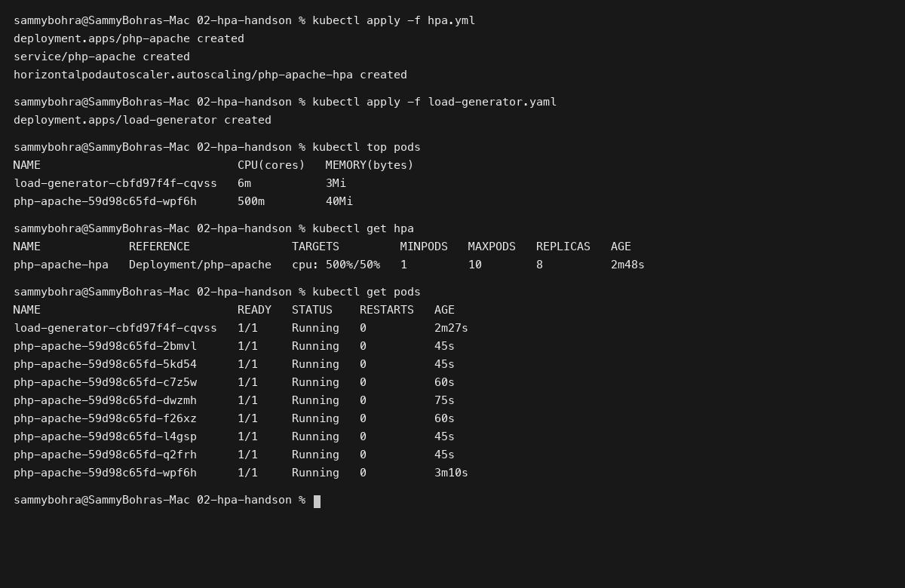
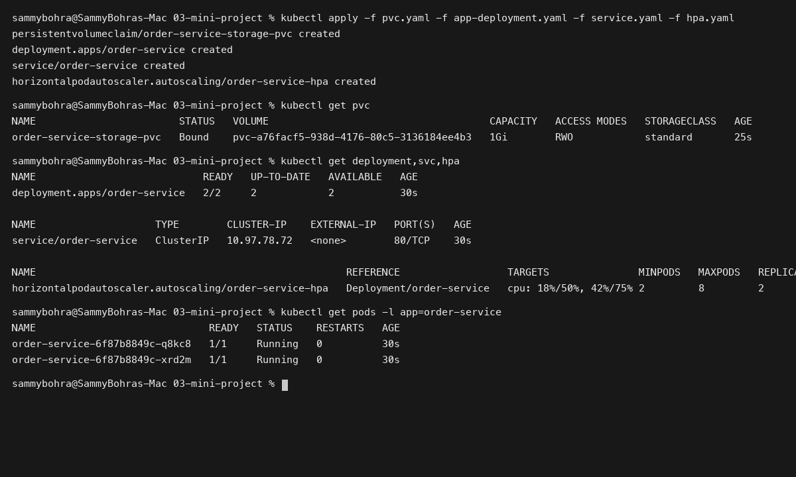

# Session 13: Kubernetes Storage, HPA & Probes

**Student Name:** Sambhav D Bohra  
**Registration Number:** 24bcs10090  

---

## Session Overview

This module covers advanced Kubernetes operational concepts:
1. **Kubernetes Storage Architecture:** Exploration of `emptyDir`, `hostPath`, `PersistentVolume`, `PersistentVolumeClaim`, `StorageClass`, and dynamic volume provisioning.
2. **Horizontal Pod Autoscaler (HPA v2):** Hands-on deployment and autoscaling under simulated HTTP load.
3. **Storage & Probes Mini Project:** Complete implementation of an autoscaled, multi-replica stateful microservice equipped with liveness probes, readiness probes, persistent claims, and traffic management.

---

## Directory Structure

```
Session 13 - Kubernetes Storage HPA and Probes/
├── 01-kubernetes-volumes/
│   ├── 01-emptydir-pod.yaml
│   ├── 02-hostpath-pod.yaml
│   ├── 03-persistent-volume.yaml
│   ├── 04-persistent-volume-claim.yaml
│   ├── 05-pod-using-pvc.yaml
│   ├── 06-storage-class.yaml
│   └── README.md
├── 02-hpa-handson/
│   ├── hpa.yml
│   ├── load-generator.yaml
│   └── README.md
├── 03-mini-project/
│   ├── app-deployment.yaml
│   ├── hpa.yaml
│   ├── load-generator.yaml
│   ├── pvc.yaml
│   ├── service.yaml
│   └── README.md
├── screenshots/
│   ├── 01-hpa-scaling-output.png
│   └── 02-miniproject-storage-probes.png
└── README.md
```

---

## Deliverables Summary

### Task 1: Volume Documentation and Manifests
- Explored all 6 storage concepts with full descriptions and practical manifests.
- Documentation available in [01-kubernetes-volumes/README.md](01-kubernetes-volumes/README.md).

### Task 2: HPA Hands-on Verification
- Configured CPU-based autoscaling for `php-apache` targeting 50% utilization.
- Deployed load generator and captured real scaling from 1 pod to 8 pods.
- Detailed step documentation in [02-hpa-handson/README.md](02-hpa-handson/README.md).

### Task 3: Mini Project Implementation
- Deployed `order-service` with dynamic Persistent Volume Claim, Liveness/Readiness probes, ClusterIP service, and CPU/Memory autoscaling.
- Detailed design and verification in [03-mini-project/README.md](03-mini-project/README.md).

---

## Visual Verification & Evidence

### 1. Horizontal Pod Autoscaler in Action


### 2. Mini Project Storage, Probes, and Cluster Status

