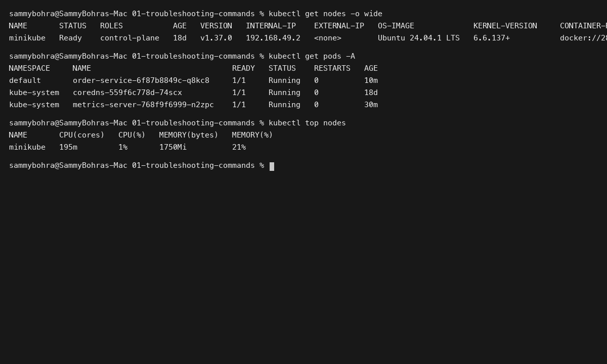
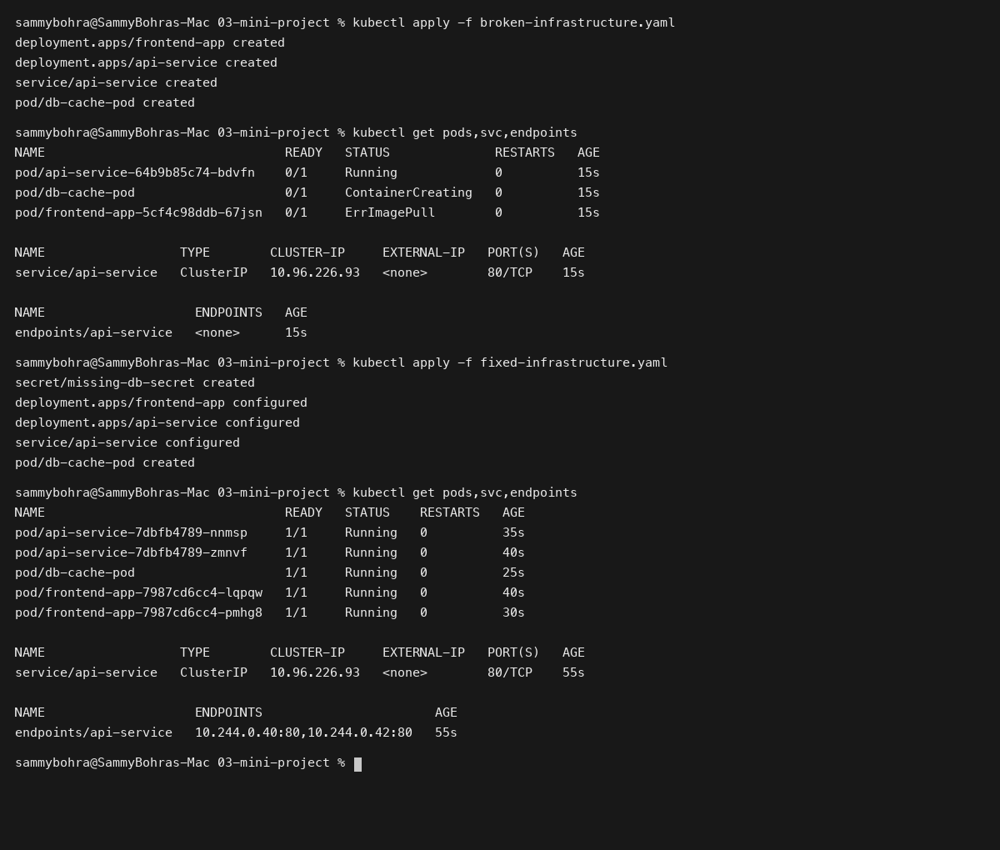

# Session 14: Kubernetes Troubleshooting

**Student Name:** Sambhav D Bohra  
**Registration Number:** 24bcs10090  

---

## Session Overview

This session focuses on practical Kubernetes debugging, root cause analysis, and remediation workflows:
1. **Core Troubleshooting Commands:** Deep dive into `kubectl get`, `describe`, `logs`, `exec`, `events`, `explain`, `top`, and `get -o wide`.
2. **Common Failure Modes:** Dedicated investigation runbooks with broken and fixed manifests for CrashLoopBackOff, ImagePullBackOff, Pending pods, ContainerCreating mount failures, Service connectivity, DNS resolution, and Configuration errors.
3. **Troubleshooting Mini Project:** Full lifecycle diagnosis of a broken multi-tier microservice architecture using the 6-step remediation process.

---

## Directory Structure

```
Session 14 - Kubernetes Troubleshooting/
├── 01-troubleshooting-commands/
│   └── README.md
├── 02-common-issues/
│   ├── 01-crashloopbackoff/
│   │   ├── broken.yaml
│   │   ├── fixed.yaml
│   │   └── README.md
│   ├── 02-imagepullbackoff-errimagepull/
│   │   ├── broken.yaml
│   │   ├── fixed.yaml
│   │   └── README.md
│   ├── 03-pending-unschedulable/
│   │   ├── broken.yaml
│   │   ├── fixed.yaml
│   │   └── README.md
│   ├── 04-containercreating-mountfailure/
│   │   ├── broken.yaml
│   │   ├── fixed.yaml
│   │   └── README.md
│   ├── 05-service-connectivity/
│   │   ├── broken-service.yaml
│   │   ├── fixed-service.yaml
│   │   └── README.md
│   ├── 06-dns-issues/
│   │   ├── broken-dns.yaml
│   │   ├── fixed-dns.yaml
│   │   └── README.md
│   ├── 07-pod-networking/
│   │   └── README.md
│   ├── 08-configuration-issues/
│   │   ├── broken-config.yaml
│   │   ├── fixed-config.yaml
│   │   └── README.md
│   └── README.md
├── 03-mini-project/
│   ├── broken-infrastructure.yaml
│   ├── fixed-infrastructure.yaml
│   └── README.md
├── screenshots/
│   ├── 01-troubleshooting-commands.png
│   └── 02-troubleshooting-miniproject-resolution.png
└── README.md
```

---

## Deliverables Summary

### Task 1: Troubleshooting Commands Reference
- Comprehensive command guide covering syntax, flags, diagnostics, and output formats.
- Documented in [01-troubleshooting-commands/README.md](01-troubleshooting-commands/README.md).

### Task 2: Common Issues Runbook
- Complete test cases covering 9 major Kubernetes issue patterns with paired broken and fixed manifests.
- Documented in [02-common-issues/README.md](02-common-issues/README.md).

### Task 3: Multi-Tier Mini Project Break-Fix
- Repaired multi-tier architecture spanning Frontend image failure, API readiness failure, Service endpoint selector mismatch, and missing Database secret mount.
- Documented in [03-mini-project/README.md](03-mini-project/README.md).

---

## Visual Verification & Evidence

### 1. Kubernetes Diagnostic Commands in Action


### 2. Mini Project Break-Fix Investigation & Recovery

