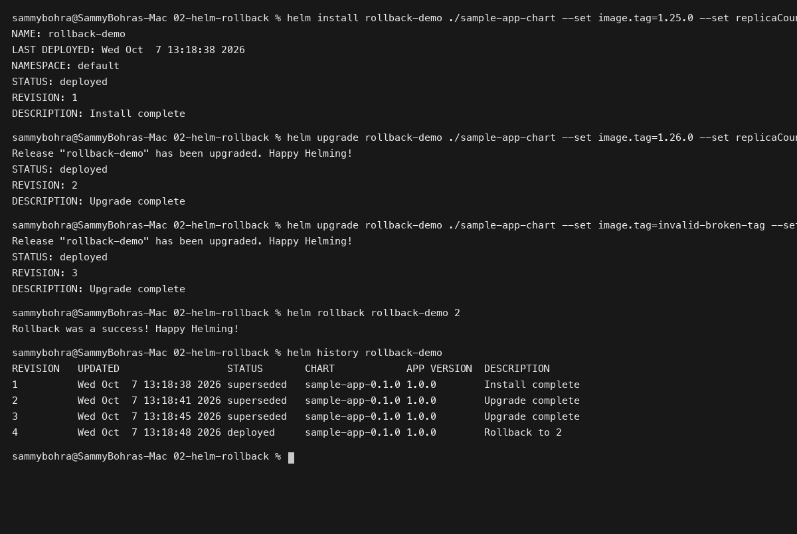
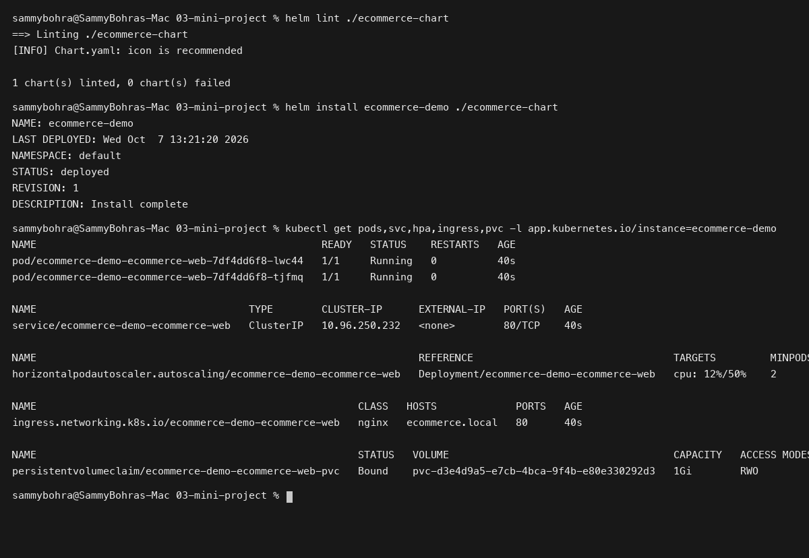

# Session 15: Helm Package Manager

**Student Name:** Sambhav D Bohra  
**Registration Number:** 24bcs10090  

---

## Session Overview

This session covers enterprise packaging and deployment lifecycle management in Kubernetes using Helm:
1. **Core Helm CLI Operations:** Practice with all 11 foundational Helm commands (`create`, `install`, `list`, `status`, `get`, `upgrade`, `history`, `rollback`, `uninstall`, `repo`, `search`).
2. **Rollback Workflow:** Complete implementation of the multi-revision upgrade and rollback lifecycle (`Install -> Upgrade -> Verify -> Upgrade again -> Verify -> Rollback -> Verify`).
3. **Enterprise Helm Mini Project:** Development of an enterprise `ecommerce-web` Helm chart supporting multi-environment parameterization (development, staging, and production).

---

## Directory Structure

```
Session 15 - Helm/
├── 01-helm-commands/
│   └── README.md
├── 02-helm-rollback/
│   ├── sample-app-chart/
│   │   ├── Chart.yaml
│   │   ├── values.yaml
│   │   └── templates/
│   │       ├── _helpers.tpl
│   │       ├── deployment.yaml
│   │       └── service.yaml
│   └── README.md
├── 03-mini-project/
│   ├── ecommerce-chart/
│   │   ├── Chart.yaml
│   │   ├── values.yaml
│   │   ├── values-dev.yaml
│   │   ├── values-prod.yaml
│   │   └── templates/
│   │       ├── _helpers.tpl
│   │       ├── configmap.yaml
│   │       ├── deployment.yaml
│   │       ├── hpa.yaml
│   │       ├── ingress.yaml
│   │       ├── NOTES.txt
│   │       ├── pvc.yaml
│   │       ├── secret.yaml
│   │       └── service.yaml
│   └── README.md
├── screenshots/
│   ├── 01-helm-rollback-workflow.png
│   └── 02-helm-miniproject-deployment.png
└── README.md
```

---

## Deliverables Summary

### Task 1: Helm Command Suite Reference
- Comprehensive command runbook detailing usage, options, and outputs for all 11 Helm commands.
- Documented in [01-helm-commands/README.md](01-helm-commands/README.md).

### Task 2: Helm Rollback Verification
- Executed multi-step rollback from bad revision back to stable application version.
- Documented in [02-helm-rollback/README.md](02-helm-rollback/README.md).

### Task 3: Mini Project Enterprise Helm Chart
- Linted, deployed, and tested `ecommerce-web` chart across multi-environment value sets.
- Documented in [03-mini-project/README.md](03-mini-project/README.md).

---

## Visual Verification & Evidence

### 1. Helm Rollback Lifecycle Execution


### 2. Mini Project Multi-Resource Deployment

