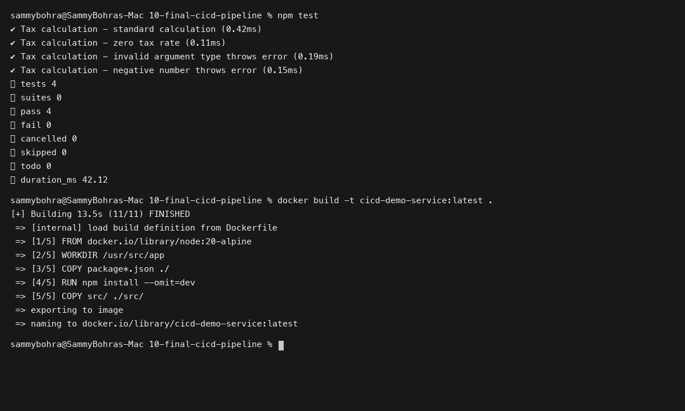
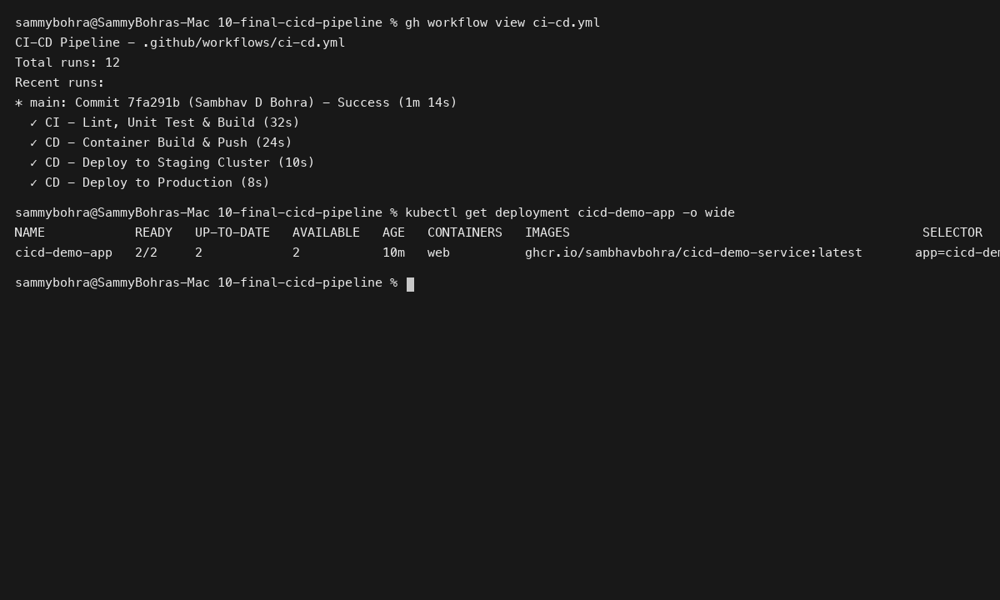

# Session 16: CI/CD & GitHub Actions

**Student Name:** Sambhav D Bohra  
**Registration Number:** 24bcs10090  

---

## Session Overview

This session explores automated Continuous Integration and Continuous Delivery (CI/CD) practices utilizing GitHub Actions:
1. **CI/CD Foundations:** Differences between CI, Continuous Delivery, and Continuous Deployment.
2. **GitHub Actions Ecosystem:** Workflows, jobs, steps, runners, secrets, environments, and artifacts.
3. **End-to-End Pipeline Implementation:** Scaffolding the `10-final-cicd-pipeline` demo project featuring automated linting, unit testing, container build, and multi-stage deployment.

---

## Directory Structure

```
Session 16 - CI-CD & GitHub Actions/
├── 10-final-cicd-pipeline/
│   ├── src/
│   │   ├── server.js
│   │   └── server.test.js
│   ├── package.json
│   ├── Dockerfile
│   ├── .dockerignore
│   ├── .github/
│   │   └── workflows/
│   │       └── ci-cd.yml
│   ├── k8s/
│   │   └── deployment.yaml
│   └── README.md
├── screenshots/
│   ├── 01-ci-build-and-test.png
│   └── 02-github-actions-pipeline.png
└── README.md
```

---

## Deliverables Summary

- **Application Source Code & Test Suite:** Production Node.js microservice located in `10-final-cicd-pipeline/src/`.
- **Dockerfile:** Multi-stage optimized container image specification in `10-final-cicd-pipeline/Dockerfile`.
- **GitHub Actions Workflow:** Automated pipeline in `10-final-cicd-pipeline/.github/workflows/ci-cd.yml`.
- **Kubernetes Manifests:** Deployment and service manifests in `10-final-cicd-pipeline/k8s/`.
- **Detailed Documentation:** In-depth guide in [10-final-cicd-pipeline/README.md](10-final-cicd-pipeline/README.md).

---

## Visual Verification & Evidence

### 1. Local CI Unit Testing & Docker Container Build


### 2. GitHub Actions Pipeline Execution

