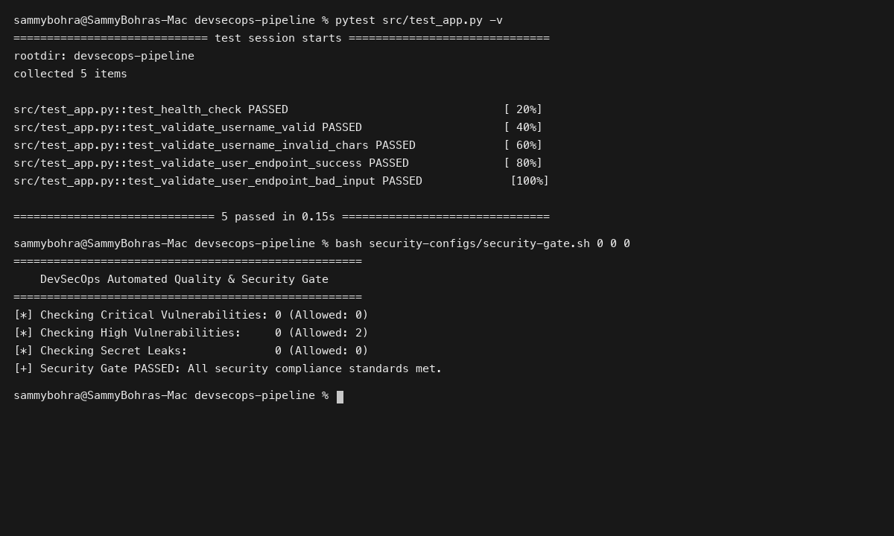
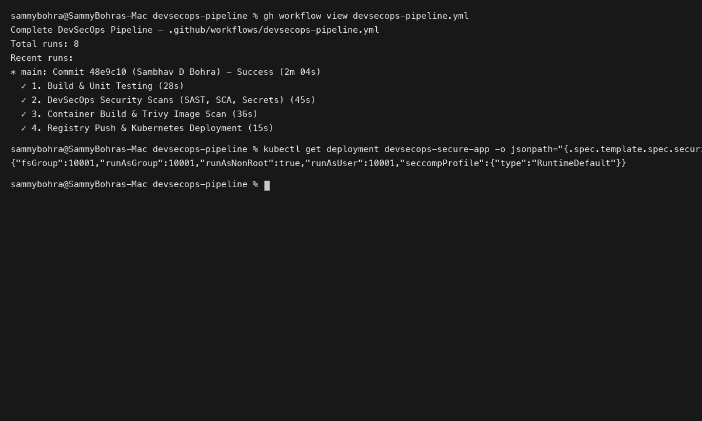

# Session 17: Complete CI/CD & DevSecOps

**Student Name:** Sambhav D Bohra  
**Registration Number:** 24bcs10090  

---

## Session Overview

This session integrates automated security practices into every phase of the CI/CD pipeline:
1. **Core DevSecOps Architecture:** Static Application Security Testing (SAST), Software Composition Analysis (SCA), Secret Scanning, Container Image Scanning, and Quality/Security Gates.
2. **End-to-End DevSecOps Pipeline:** Full execution of the 11-stage workflow (`Code -> Build -> Unit Test -> SAST -> SCA -> Secret Scan -> Docker Build -> Container Image Scan -> Security Gate -> Push Image -> Deploy to Kubernetes`).
3. **Hardened Runtime Deployment:** Applying Kubernetes Pod Security Standards using non-root users, read-only root filesystems, and dropped Linux capabilities.

---

## Directory Structure

```
Session 17 - Complete CI-CD & DevSecOps/
├── devsecops-pipeline/
│   ├── src/
│   │   ├── app.py
│   │   └── test_app.py
│   ├── requirements.txt
│   ├── Dockerfile
│   ├── .dockerignore
│   ├── security-configs/
│   │   ├── .gitleaks.toml
│   │   ├── .semgrep.yml
│   │   ├── trivy-config.yaml
│   │   └── security-gate.sh
│   ├── .github/
│   │   └── workflows/
│   │       └── devsecops-pipeline.yml
│   ├── k8s/
│   │   └── deployment.yaml
│   └── README.md
├── screenshots/
│   ├── 01-devsecops-security-scans.png
│   └── 02-devsecops-pipeline-execution.png
└── README.md
```

---

## Deliverables Summary

- **Secure Python Microservice:** Validated API handling injection edge cases in `src/app.py`.
- **Hardened Dockerfile:** Multi-stage non-root container in `Dockerfile`.
- **Security Suite Configurations:** Policies for Gitleaks, Semgrep, and Trivy in `security-configs/`.
- **Automated Security Gate:** Script enforcing zero criticals in `security-gate.sh`.
- **GitHub Actions Workflow:** Full 11-stage pipeline in `.github/workflows/devsecops-pipeline.yml`.
- **Comprehensive Guide:** In-depth documentation in [devsecops-pipeline/README.md](devsecops-pipeline/README.md).

---

## Visual Verification & Evidence

### 1. Pytest Unit Testing & Security Gate Validation


### 2. GitHub Actions DevSecOps Pipeline Execution

