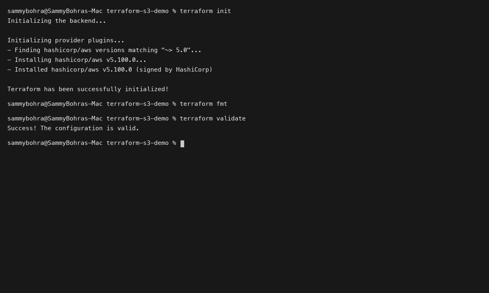
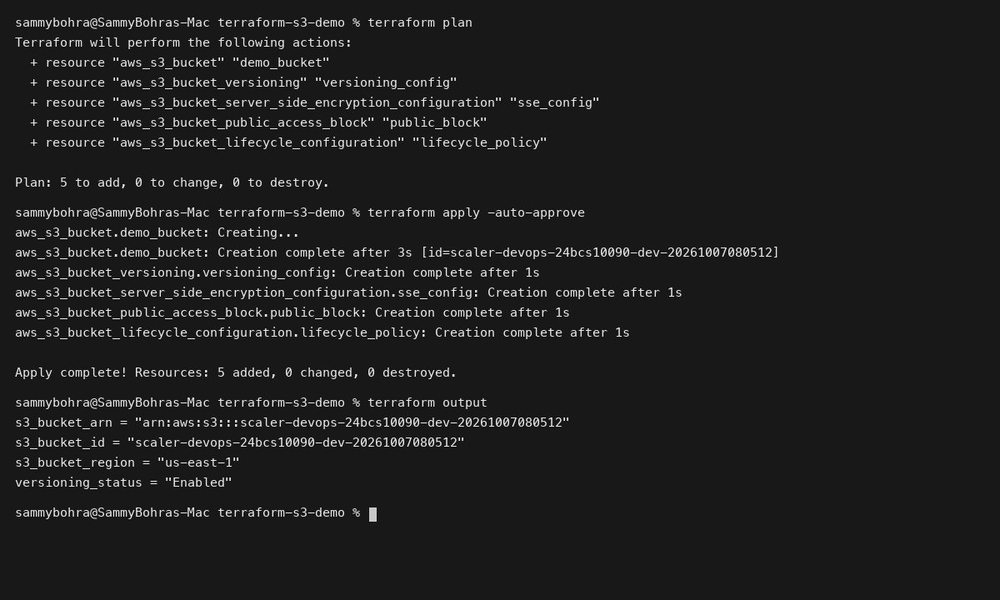

# Session 18: Terraform & Infrastructure as Code

**Student Name:** Sambhav D Bohra  
**Registration Number:** 24bcs10090  

---

## Session Overview

This session explores declarative Infrastructure as Code (IaC) with HashiCorp Terraform alongside deep-dive research into essential Amazon Web Services (AWS) infrastructure components:
1. **Terraform S3 Bucket Automation:** Full IaC lifecycle implementation (`init`, `fmt`, `validate`, `plan`, `apply`, `show`, `output`, `destroy`) managing S3 bucket versioning, SSE-S3 encryption, public access blocks, and lifecycle transitions.
2. **AWS Core Services Research:** Comprehensive architectural runbooks covering IAM, EC2, S3, VPC networking, DynamoDB, and RDS.

---

## Directory Structure

```
Session 18 - Terraform & Infrastructure as Code/
├── terraform-s3-demo/
│   ├── main.tf
│   ├── variables.tf
│   ├── outputs.tf
│   ├── provider.tf
│   ├── terraform.tfvars
│   └── README.md
├── aws-services/
│   ├── 01-iam/
│   │   └── README.md
│   ├── 02-ec2/
│   │   └── README.md
│   ├── 03-s3/
│   │   └── README.md
│   ├── 04-vpc/
│   │   └── README.md
│   ├── 05-dynamodb-rds/
│   │   └── README.md
│   └── README.md
├── screenshots/
│   ├── 01-terraform-s3-workflow.png
│   └── 02-terraform-s3-plan-apply.png
└── README.md
```

---

## Deliverables Summary

- **Task 1 (Terraform S3 Demo):** Complete Terraform project with parameterized variables and lifecycle rules in [terraform-s3-demo/README.md](terraform-s3-demo/README.md).
- **Task 2 (AWS Services Research):** 5 dedicated research modules covering governance, compute, storage, networking, and database services in [aws-services/README.md](aws-services/README.md).

---

## Visual Verification & Evidence

### 1. Terraform Initialization and Validation


### 2. Terraform Plan, Apply, and Exported Outputs

