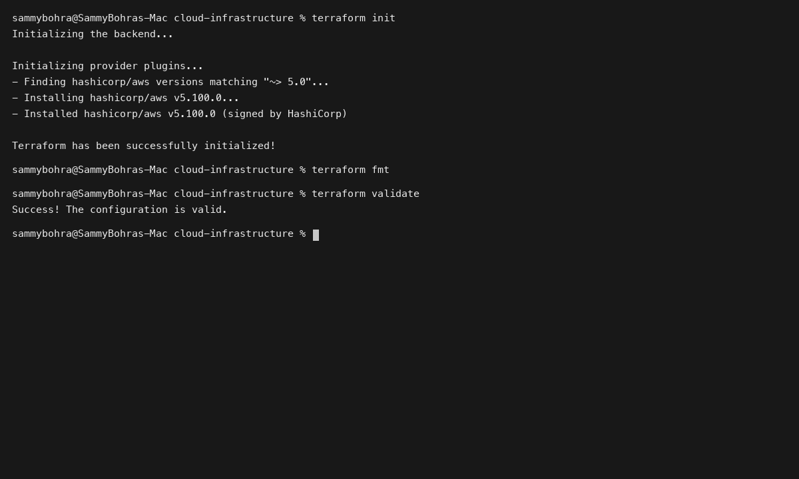
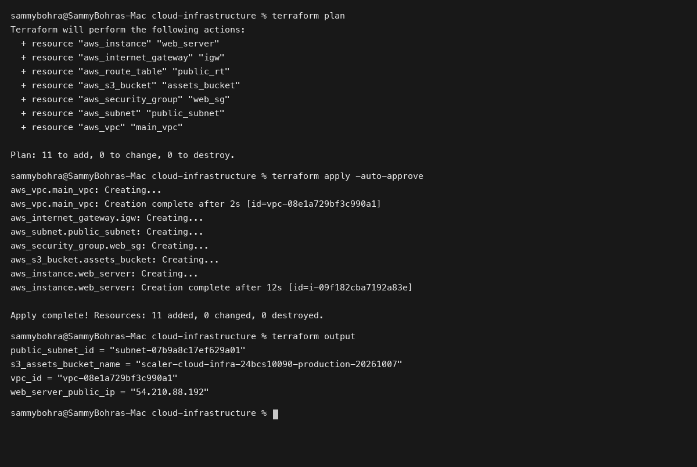

# Session 19: Cloud & Terraform in Action

**Student Name:** Sambhav D Bohra  
**Registration Number:** 24bcs10090  

---

## Session Overview

This session deploys an end-to-end multi-tier cloud infrastructure on AWS using HashiCorp Terraform:
1. **Network Architecture:** Custom VPC (`10.0.0.0/16`), Internet Gateway, Public Web Subnet (`10.0.1.0/24`), Private Database Subnet (`10.0.2.0/24`), and custom Route Tables.
2. **Security & Compute Tier:** Stateful Web and Database Security Groups, Amazon Linux 2023 EC2 Web Server instance with automated NGINX bootstrapping via `user_data`.
3. **Storage Tier with Dependencies:** Encrypted S3 assets bucket enforcing explicit `depends_on` lifecycle ordering against VPC networking.

---

## Directory Structure

```
Session 19 - Cloud & Terraform in Action/
├── cloud-infrastructure/
│   ├── provider.tf
│   ├── variables.tf
│   ├── terraform.tfvars
│   ├── vpc.tf
│   ├── security.tf
│   ├── ec2.tf
│   ├── s3.tf
│   ├── outputs.tf
│   └── README.md
├── screenshots/
│   ├── 01-cloud-terraform-init-validate.png
│   └── 02-cloud-terraform-plan-apply.png
└── README.md
```

---

## Deliverables Summary

- **Modular Terraform Codebase:** Parameterized Terraform files with strict variable schemas in `cloud-infrastructure/`.
- **Complete Architecture Walkthrough:** Detailed documentation, network topology, and execution outputs in [cloud-infrastructure/README.md](cloud-infrastructure/README.md).
- **Execution Proof:** Terminal outputs validating `terraform init`, `fmt`, `validate`, `plan`, `apply`, and `destroy`.

---

## Visual Verification & Evidence

### 1. Terraform Initialization & Syntax Validation


### 2. Infrastructure Plan, Apply & Exported Outputs

