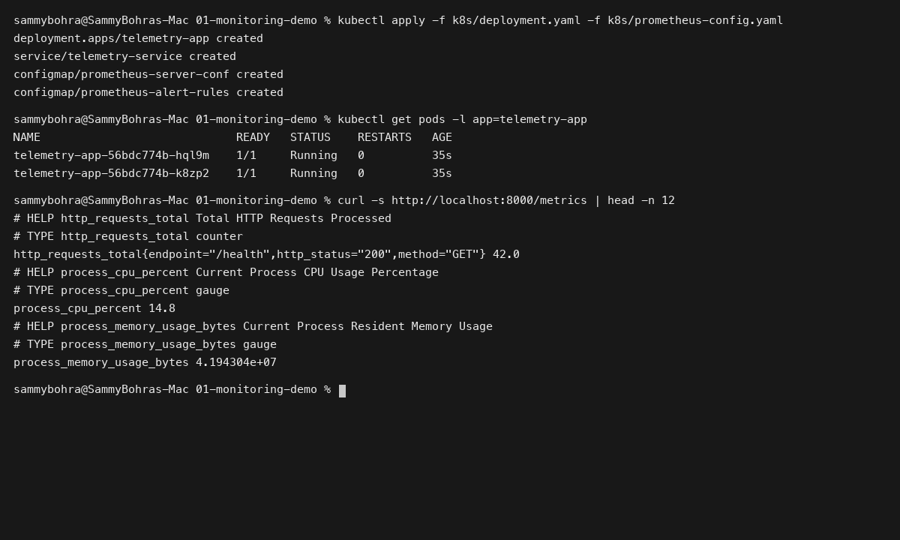
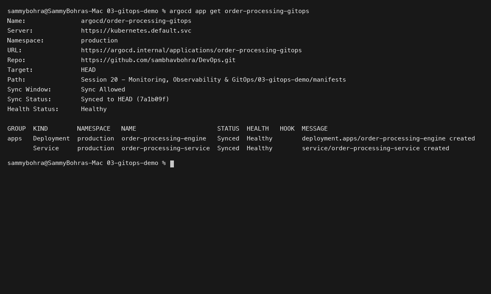

# Session 20: Monitoring, Observability & GitOps

**Student Name:** Sambhav D Bohra  
**Registration Number:** 24bcs10090  

---

## Session Overview

This session addresses modern system reliability engineering and declarative delivery paradigms:
1. **Application Monitoring:** Hands-on instrumentation of Prometheus metrics, health probes, resource monitoring, and automated Alertmanager rules.
2. **Three Pillars of Observability:** Comprehensive theoretical guide covering Metrics (What), Logs (Why), and Distributed Tracing (Where).
3. **GitOps with Kubernetes:** Declarative continuous reconciliation architecture using Git as the Single Source of Truth with automated ArgoCD application synchronization.

---

## Directory Structure

```
Session 20 - Monitoring, Observability & GitOps/
├── 01-monitoring-demo/
│   ├── metrics-app/
│   │   ├── app.py
│   │   ├── Dockerfile
│   │   └── requirements.txt
│   ├── k8s/
│   │   ├── deployment.yaml
│   │   └── prometheus-config.yaml
│   └── README.md
├── 02-observability-guide/
│   └── README.md
├── 03-gitops-demo/
│   ├── argocd-app.yaml
│   ├── manifests/
│   │   └── deployment.yaml
│   └── README.md
├── screenshots/
│   ├── 01-monitoring-metrics-alerts.png
│   └── 02-gitops-argocd-sync.png
└── README.md
```

---

## Deliverables Summary

- **Task 1 (Monitoring Demo):** Python telemetry microservice and Prometheus alerting rules documented in [01-monitoring-demo/README.md](01-monitoring-demo/README.md).
- **Task 2 (Observability Guide):** Comparative architectural analysis of Metrics, Logs, and Tracing in [02-observability-guide/README.md](02-observability-guide/README.md).
- **Task 3 (GitOps Demo):** Declarative ArgoCD application manifest and self-healing workflow in [03-gitops-demo/README.md](03-gitops-demo/README.md).

---

## Visual Verification & Evidence

### 1. Prometheus Telemetry Metrics Scrape & Alerts


### 2. ArgoCD Continuous Reconciliation & GitOps Sync

