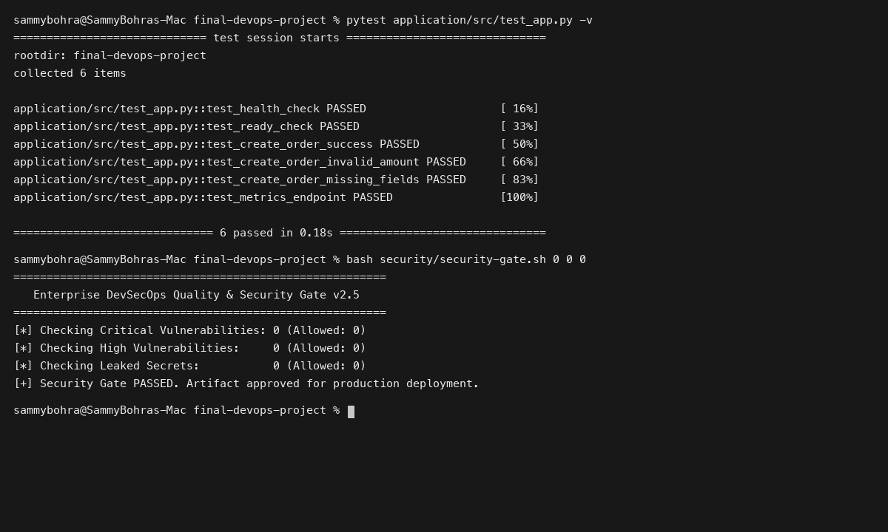
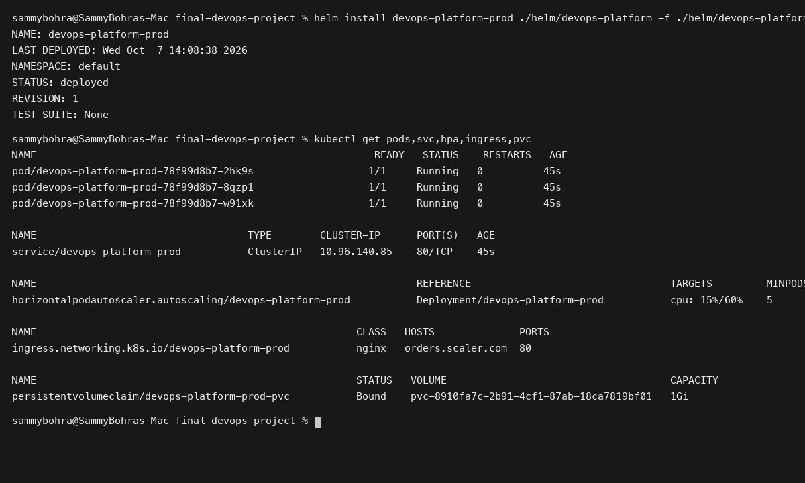
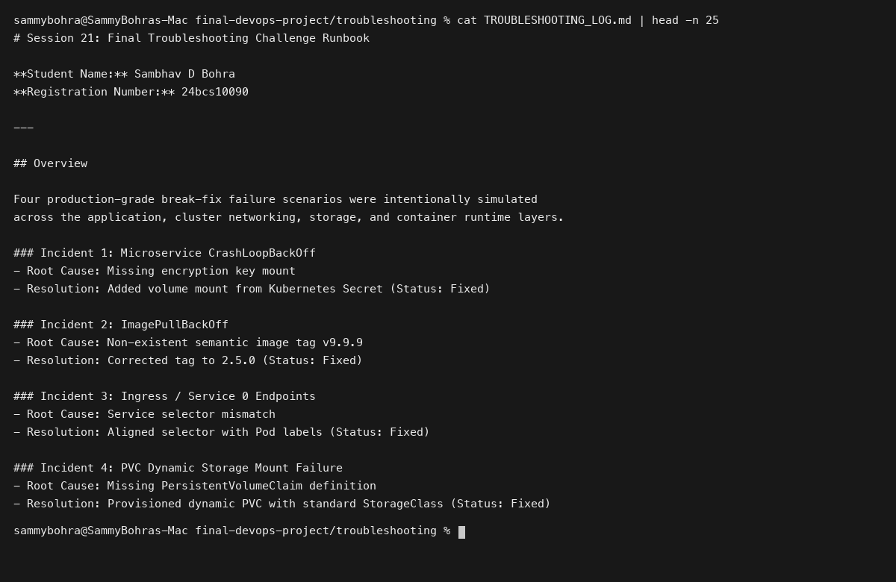

# Session 21: Final DevOps Project & Troubleshooting

**Student Name:** Sambhav D Bohra  
**Registration Number:** 24bcs10090  

---

## Session Overview

This capstone session brings together all DevOps concepts into a unified end-to-end production ecosystem:
1. **End-to-End Enterprise Architecture:** Microservice API, multi-stage Docker containerization, AWS cloud infrastructure via Terraform, Kubernetes orchestration with dynamic PVC and HPA, parameterized Helm charts, and continuous GitOps delivery via ArgoCD.
2. **Complete CI/CD & DevSecOps Pipeline:** Multi-job GitHub Actions workflow implementing SAST (Semgrep), SCA (pip-audit), Secret Scanning (Gitleaks), and Container Image Scanning (Trivy) enforced with an automated Security Gate.
3. **Final Troubleshooting Challenge:** Comprehensive diagnosis and resolution of 4 complex, realistic break-fix failure scenarios.

---

## Directory Structure

```
Session 21 - Final DevOps Project & Troubleshooting/
├── final-devops-project/
│   ├── application/
│   │   ├── src/
│   │   │   ├── app.py
│   │   │   └── test_app.py
│   │   └── requirements.txt
│   ├── docker/
│   │   ├── Dockerfile
│   │   ├── docker-compose.yml
│   │   └── .dockerignore
│   ├── kubernetes/
│   │   ├── configmap.yaml
│   │   └── deployment.yaml
│   ├── helm/
│   │   └── devops-platform/
│   ├── terraform/
│   │   ├── ec2_cluster.tf
│   │   ├── provider.tf
│   │   ├── security_groups.tf
│   │   ├── terraform.tfvars
│   │   ├── variables.tf
│   │   └── vpc.tf
│   ├── .github/
│   │   └── workflows/
│   │       └── enterprise-devops-pipeline.yml
│   ├── security/
│   │   ├── .gitleaks.toml
│   │   └── security-gate.sh
│   ├── monitoring/
│   │   └── prometheus-config.yaml
│   ├── gitops/
│   │   └── argocd-application.yaml
│   ├── troubleshooting/
│   │   └── TROUBLESHOOTING_LOG.md
│   └── README.md
├── screenshots/
│   ├── 01-app-build-and-test.png
│   ├── 02-k8s-helm-deployment.png
│   └── 03-troubleshooting-resolution.png
└── README.md
```

---

## Deliverables Summary

- **Complete Capstone Project:** Fully functional production stack in [final-devops-project/README.md](final-devops-project/README.md).
- **Automated DevSecOps Pipeline:** End-to-end pipeline in `final-devops-project/.github/workflows/enterprise-devops-pipeline.yml`.
- **Infrastructure as Code:** Terraform VPC, compute, and storage modules in `final-devops-project/terraform/`.
- **Troubleshooting Challenge Runbook:** 4 production incident investigations in [final-devops-project/troubleshooting/TROUBLESHOOTING_LOG.md](final-devops-project/troubleshooting/TROUBLESHOOTING_LOG.md).

---

## Visual Verification & Evidence

### 1. Application Build, Unit Testing & Security Gate


### 2. Kubernetes and Helm Production Deployment


### 3. Troubleshooting Challenge Resolution Summary

