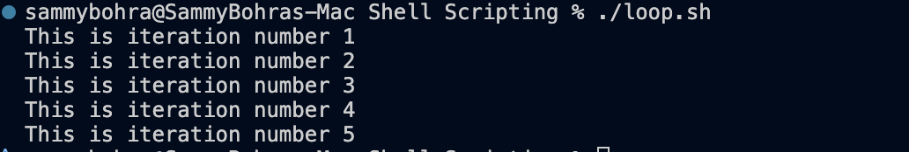
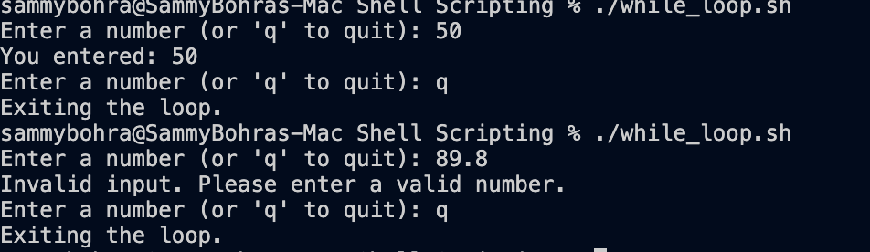
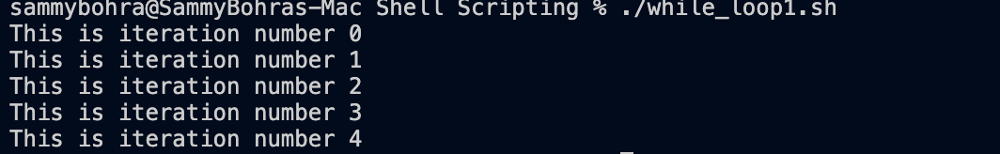

# Shell Scripting Examples

This folder contains Bash scripts for variables, input, conditions, loops, and task-based examples.

## 1. Variable Example

File: `variable.sh`

```bash
name="Sambhav"
rollno=10090
comment="Goat"

mkdir variable
cd variable
touch app.log
echo "My name is $name and my rollno is $rollno and my comment is $comment" > app.log
cat app.log
```

### Output
```bash
My name is Sambhav and my rollno is 10090 and my comment is Goat
```

### Screenshot


---

## 2. Input Example

File: `input.sh`

```bash
read -p "Enter your name: " name
read -p "Enter your rollno: " rollno
read -p "Enter your comment: " comment

echo "My name is $name and my rollno is $rollno and my comment is $comment"
```

### Example Output
```bash
Enter your name: Sam
Enter your rollno: 101
Enter your comment: Good
My name is Sam and my rollno is 101 and my comment is Good
```

### Screenshot


---

## 3. Task Example

File: `task.sh`

```bash
mkdir task && cd task

touch user.log
echo "Todays date is $(date)" > user.log
echo "Hostname is $(hostname)" >> user.log
echo "user is $(whoami)" >> user.log
cat user.log

touch process.log
echo "Process is $(ps)" > process.log
cat process.log

read -p "Enter your name: " name
read -p "Enter your rollno: " rollno
read -p "Enter your comment: " comment

touch personal.log
echo "My name is $name and my rollno is $rollno and my comment is $comment" > personal.log
cat personal.log
```

### Example Output
```bash
Todays date is Tue Aug 18 2026 12:00:00 IST
Hostname is MacBook-Pro
user is sammy
Process is ...
My name is Sam and my rollno is 101 and my comment is Good
```

### Screenshot


---

## 4. Condition Example

File: `condition.sh`

```bash
read -p "Enter the age: " age

if [ $age -gt 18 ]
then
    echo "You are eligible to vote"
else
    echo "You are not eligible to vote"
fi
```

### Screenshot


---

## 5. For Loop Example

File: `loop.sh`

```bash
for i in {1..5}
do
  echo "This is iteration number $i"
done
```

### Screenshot


---

## 6. While Loop Example

File: `while_loop.sh`

This loop keeps asking for input until the user enters `q`.
It checks whether the value is a valid number using a regular expression pattern.
If the input is `q`, the loop exits.
If the input is not a number, it shows an invalid input message and continues.

```bash
while true; do
    read -p "Enter a number (or 'q' to quit): " input

    if [[ $input == "q" ]]; then
        echo "Exiting the loop."
        break
    elif ! [[ $input =~ ^[0-9]+$ ]]; then
        echo "Invalid input. Please enter a valid number."
        continue
    fi

    echo "You entered: $input"
done
```

### Behavior
- `q` → stops the loop
- valid number → prints the number
- invalid text → prints a validation message and asks again

### Screenshot


---

## 7. While Loop Counter Example

File: `while_loop1.sh`

```bash
count=0
while [ $count -lt 5 ]
do
  echo "This is iteration number $count"
  ((count++))
done
```

### Screenshot


---

## 8. Data Example

File: `data.sh`

```bash
mkdir data3
cd data3
touch app.log
echo "Hello World" > app.log
cat app.log
echo "heelo world overwritten" > app.log
cat app.log
```

### Status
No screenshot has been added for this example yet.

---

## Screenshot Folder
All screenshots are stored in the `screenshots/` folder.
