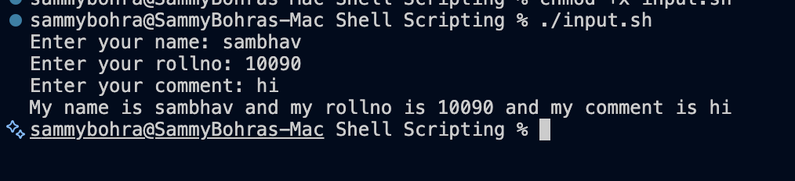

# Shell Scripting - Variables and Input

This folder contains examples of variables and user input in Bash.

## 1. Variable example

File: variable.sh

```bash
name="Sambhav"
rollno=10090
comment="Goat"

mkdir variable
cd variable
touch app.log
echo "My name is $name and my rollno is $rollno and my comment is $comment" > app.log
cat app.log
```

### Output
```bash
My name is Sambhav and my rollno is 10090 and my comment is Goat
```

### Screenshot


---

## 2. Input example

File: input.sh

```bash
read -p "Enter your name: " name
read -p "Enter your rollno: " rollno
read -p "Enter your comment: " comment

echo "My name is $name and my rollno is $rollno and my comment is $comment"
```

### Example interactive output
```bash
Enter your name: Sam
Enter your rollno: 101
Enter your comment: Good
My name is Sam and my rollno is 101 and my comment is Good
```

### Screenshot


Folder: screenshots/
