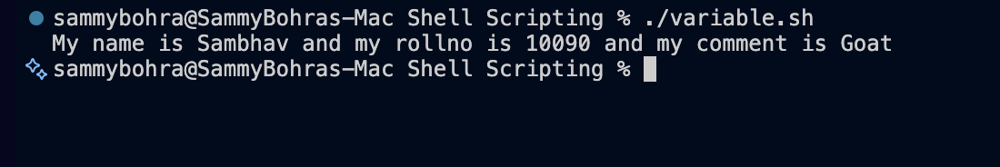

# Shell Scripting - Variables

This script demonstrates how variables are declared and used in Bash.

## File
- `variable.sh`

## Example script
```bash
name="Sambhav"
rollno=10090
comment="Goat"

mkdir variable
cd variable
touch app.log
echo "My name is $name and my rollno is $rollno and my comment is $comment" > app.log
cat app.log
```

## Variable output
```bash
My name is Sambhav and my rollno is 10090 and my comment is Goat
```

## Screenshot
The output screenshot is stored in the screenshot folder:



Folder: `screenshots/`
