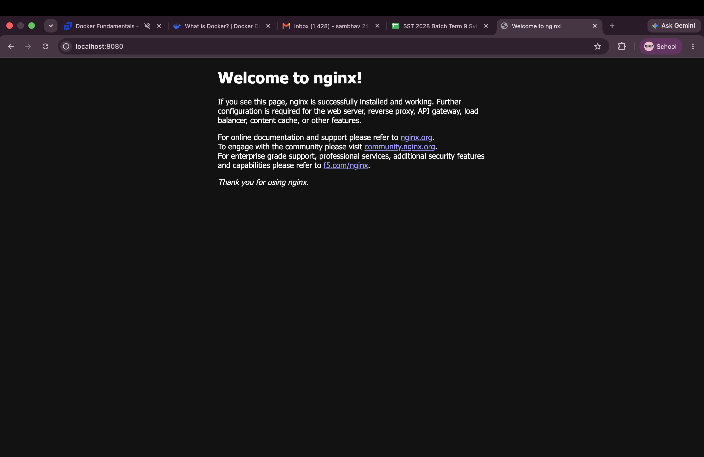

# Docker Practice - Nginx Web Server

This folder contains a simple Docker-based web server practice using the official `nginx` image.

## Objective

The goal is to learn how to:

- pull a Docker image
- run a container
- expose a container port to the local machine
- access a running web page in the browser

## What this folder contains

- `Command page.png` - screenshot of Docker commands and output
- `localhost_page.png` - screenshot of the Nginx default welcome page in the browser

## Docker workflow used

### 1. Pull the nginx image

```bash
docker pull nginx
```

### 2. Run the container

```bash
docker run -d --name nginx -p 80:80 nginx
```

### 3. Check the running container

```bash
docker ps
```

### 4. Open in browser

Visit:

```bash
http://localhost:80
```

You should see the default Nginx welcome page with the message:

> Welcome to nginx!

## Expected result

The browser loads the default Nginx page, which confirms that the Docker container is running successfully and serving a web page.

## Screenshots

### Docker terminal output


### Browser view of the running Nginx page



## Example terminal output

The screenshots show:

- Docker pulling the `nginx:latest` image
- the image being downloaded and built
- the container running in detached mode
- Nginx serving the default page on port 80

## Notes

This is a beginner-friendly Docker exercise for understanding container basics and web hosting with Nginx.

## Prerequisites

- Docker installed and running
- Browser access to localhost
- Terminal access

## Summary

This project demonstrates the basics of containerizing a web application and serving it locally using Docker and Nginx.
